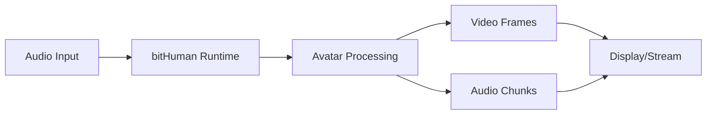

# Welcome to bitHuman SDK Documentation

> Build interactive agents that respond realistically to audio input

## What is bitHuman SDK?

bitHuman SDK enables developers to create lifelike digital avatars that can respond to audio input with realistic facial movements, expressions, and synchronized speech. Our SDK transforms your applications with engaging, human-like interactions.

## Key Features

- **🎯 Real-time Avatar Animation** - Generate 25 FPS video with synchronized audio
- **🎤 Audio-driven Expressions** - Realistic facial movements from audio input
- **🚀 Multiple Deployment Options** - Self-hosted, CPU cloud, or GPU cloud
- **🔌 Easy Integration** - Works with LiveKit, FastRTC, and custom applications
- **📱 Cross-platform Support** - Linux, macOS, and cloud deployments

## Quick Start

Get up and running with bitHuman SDK in just a few steps:

1. **[Register for free](https://console.bithuman.io)** and get your API secret
2. **[Download an avatar model](https://console.bithuman.io/#community)** (.imx file)
3. **[Install the SDK](getting-started/installation.md)** with pip
4. **[Run your first model](getting-started/first-model.md)** in minutes

```bash
# Install the SDK
pip install bithuman

# Set up your environment
export BITHUMAN_API_SECRET='your_api_secret'
export BITHUMAN_AVATAR_MODEL='/path/to/model/avatar.imx'

# Run a basic example
python basic_example.py
```

## Supported Platforms

| Platform | Support | Notes |
|----------|---------|-------|
| **Linux (x86_64)** | ✅ Full | Recommended for production |
| **Linux (arm64)** | ✅ Full | Great for edge deployments |
| **macOS (Apple Silicon)** | ✅ Full | macOS 15+ required |
| **Windows** | 🔄 Coming Soon | Beta available |

## Use Cases

### 🎬 Interactive Content
Create engaging educational content, virtual presenters, and entertainment experiences.

### 🛒 E-commerce
Build virtual shopping assistants and product demonstrations with lifelike avatars.

### 📞 Customer Service
Deploy AI-powered customer service agents with human-like interactions.

### 🎮 Gaming & Metaverse
Integrate realistic NPCs and avatars into games and virtual worlds.

## Architecture Overview



The bitHuman SDK processes 16kHz mono audio input and generates synchronized video frames at 25 FPS with corresponding audio chunks.

## Community & Support

- 🌟 **[Community Hub](https://console.bithuman.io/#community)** - Download models and share creations
- 📖 **[Documentation](/)** - Complete guides and API reference
- 💬 **[Discord](https://discord.gg/bithuman)** - Join our developer community
- 🐛 **[GitHub Issues](https://github.com/bithuman-io/sdk-examples-python/issues)** - Report bugs and request features

## What's Next?

Ready to build with bitHuman? Here are some great starting points:

- **New to bitHuman?** Start with our [Getting Started Guide](getting-started/overview.md)
- **Want to create an agent?** Check out [Generate bitHuman Agent](generate-agent/prompt-guidelines.md)
- **Ready to deploy?** Explore [Build with bitHuman](build/self-hosted.md)
- **Need specific integrations?** Browse our [Integrations](integrations/livekit.md)
- **Want to see examples?** Try our [Code Examples](examples/voice-driven-audio.md)

---

*Get started with bitHuman SDK today and bring your applications to life with realistic digital avatars.*
