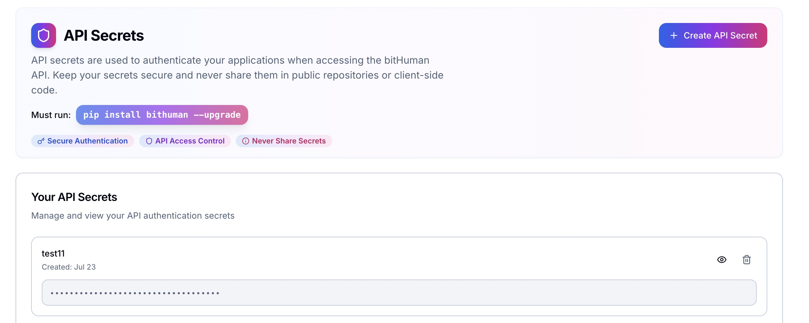
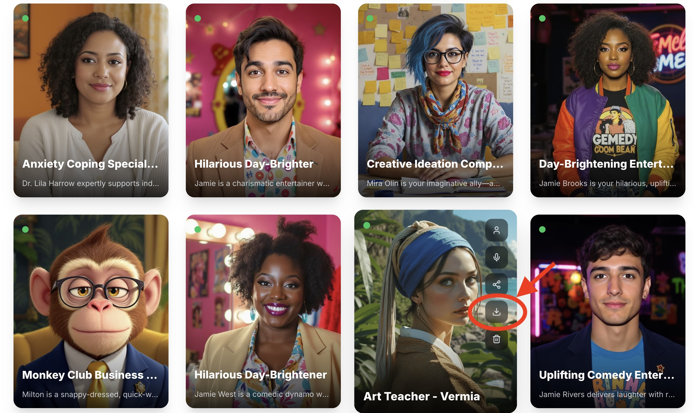

# 🚀 bitHuman SDK

> **Create lifelike digital avatars that respond to audio in real-time**

<style>
@keyframes pulseGlow {
  0%, 100% { box-shadow: 0 8px 25px rgba(102, 126, 234, 0.3); }
  50% { box-shadow: 0 8px 25px rgba(102, 126, 234, 0.5); }
}
@keyframes pulseGlowPink {
  0%, 100% { box-shadow: 0 8px 25px rgba(240, 147, 251, 0.3); }
  50% { box-shadow: 0 8px 25px rgba(240, 147, 251, 0.5); }
}
.panel-openai {
  animation: pulseGlow 3s ease-in-out infinite;
}
.panel-apple {
  animation: pulseGlowPink 3s ease-in-out infinite;
}
</style>

<div style="display: flex; gap: 20px; margin: 30px 0; flex-wrap: wrap;">

<div class="panel-openai" style="flex: 1; min-width: 300px; background: linear-gradient(135deg, #667eea 0%, #764ba2 100%); border-radius: 15px; padding: 25px; color: white; text-align: center; box-shadow: 0 8px 25px rgba(102, 126, 234, 0.3); transition: all 0.3s ease; cursor: pointer;" onmouseover="this.style.transform='translateY(-5px) scale(1.02)'; this.style.boxShadow='0 15px 35px rgba(102, 126, 234, 0.6)'; this.style.animation='none'" onmouseout="this.style.transform='translateY(0) scale(1)'; this.style.boxShadow='0 8px 25px rgba(102, 126, 234, 0.3)'; this.className='panel-openai'">
  <a href="https://github.com/bithuman-prod/public-docker-example" style="text-decoration: none; color: white; display: block;">
    <div style="display: flex; align-items: center; justify-content: center; gap: 15px; margin-bottom: 15px;">
      
      <h3 style="margin: 0; font-size: 24px;">bitHuman + OpenAI</h3>
    </div>
    <p style="margin: 0 0 15px 0; font-size: 16px; opacity: 0.9;">Complete Docker setup with web UI</p>
    <div style="background: rgba(255,255,255,0.2); padding: 12px; border-radius: 8px; margin: 15px 0;">
      <strong>✨ Cloud-Powered AI Conversations</strong>
    </div>
    <p style="margin: 10px 0 0 0; font-size: 14px; opacity: 0.8;">LiveKit + OpenAI + Web Interface</p>
  </a>
</div>

<div class="panel-apple" style="flex: 1; min-width: 300px; background: linear-gradient(135deg, #f093fb 0%, #f5576c 100%); border-radius: 15px; padding: 25px; color: white; text-align: center; box-shadow: 0 8px 25px rgba(240, 147, 251, 0.3); transition: all 0.3s ease; cursor: pointer;" onmouseover="this.style.transform='translateY(-5px) scale(1.02)'; this.style.boxShadow='0 15px 35px rgba(240, 147, 251, 0.6)'; this.style.animation='none'" onmouseout="this.style.transform='translateY(0) scale(1)'; this.style.boxShadow='0 8px 25px rgba(240, 147, 251, 0.3)'; this.className='panel-apple'">
  <a href="https://github.com/bithuman-prod/public-macos-offline-example" style="text-decoration: none; color: white; display: block;">
    <div style="display: flex; align-items: center; justify-content: center; gap: 15px; margin-bottom: 15px;">
      
      <h3 style="margin: 0; font-size: 24px;">bitHuman + Apple</h3>
    </div>
    <p style="margin: 0 0 15px 0; font-size: 16px; opacity: 0.9;">100% local, most cost effective</p>
    <div style="background: rgba(255,255,255,0.2); padding: 12px; border-radius: 8px; margin: 15px 0;">
      <strong>🔒 Private On-Device AI</strong>
    </div>
    <p style="margin: 10px 0 0 0; font-size: 14px; opacity: 0.8;">Apple Speech + Siri + Ollama LLM</p>
  </a>
</div>

</div>

---

## ✨ What is bitHuman SDK?

bitHuman SDK lets you build **interactive avatars** that bring your applications to life:

💻 **🌟 CPU-Only Operation** - Runs entirely on host CPU, **no GPU required!**  
💰 **10x Lower Costs** - Choose host device or CPU cloud for dramatic cost savings  
🎯 **Real-time Animation** - 25 FPS video with dynamic movement  
🎤 **Audio-driven** - Realistic facial movements from any audio input  
⚡ **Easy Integration** - 3 lines of code to get started  
🌐 **Web Ready** - Deploy to browsers with LiveKit integration  

---

## 🏃‍♂️ Quick Start

### 🐳 **Fastest Way: Complete Docker Demo**

Get a **full end-to-end bitHuman + LiveKit app with web UI** running in minutes!

**What you get:** Complete visual agent with real-time conversation, web interface, and audio support.

📦 **[Full Example Repository →](https://github.com/bithuman-prod/public-docker-example)**

#### 1️⃣ Get Your Credentials
- 🔑 **Free API Secret** → [imaginex.bithuman.ai](https://imaginex.bithuman.ai)
  
  

- 🤖 **Download Avatar** → [Community Models](https://imaginex.bithuman.ai/#community)
  
  

#### 2️⃣ Clone & Setup
```bash
# Clone the complete demo
git clone https://github.com/bithuman-prod/public-docker-example.git
cd public-docker-example

# Create environment file
echo "BITHUMAN_API_SECRET=your_api_secret_here" > .env
echo "OPENAI_API_KEY=your_openai_key_here" >> .env

# Add your .imx model files to models/ directory
mkdir -p models
# Copy your downloaded .imx files here
```

#### 3️⃣ Launch Complete App
```bash
# Start all services (LiveKit + Agent + Web UI + Redis)
docker compose up

# Open your browser to http://localhost:4202
# 🎉 Interactive avatar ready!
```

**🌟 That's it!** You now have a complete bitHuman application with:
- ✅ Real-time avatar animation
- ✅ Voice conversation capabilities  
- ✅ Professional web interface
- ✅ Full LiveKit integration

---

### 🛠️ **Alternative: SDK Integration**

For custom applications, integrate bitHuman directly:

#### Install & Setup
```bash
# Install SDK
pip install bithuman --upgrade

# Set environment
export BITHUMAN_API_SECRET="your_secret"
export BITHUMAN_MODEL_PATH="/path/to/model.imx"
```

#### Your First Avatar (3 lines!)
```python
from bithuman import AsyncBithuman

runtime = await AsyncBithuman.create(model_path="model.imx", api_secret="secret")
async for frame in runtime.run():
    display_frame(frame)  # Your magic here!
```

---

## 🎯 What You Can Build

### 🖥️ **Desktop Apps**
- Voice assistants
- Interactive kiosks  
- Custom interfaces

### 🌐 **Web Applications**
- Video chat avatars
- Customer service bots
- Virtual receptionists

### 🔧 **IoT & Edge**
- Smart home assistants
- Retail demonstrations
- Industrial interfaces

---

## 📚 Documentation Structure

### 🚀 **[Getting Started](getting-started/overview.md)**
Quick setup, prompts, media uploads, and animal mode

### 💡 **[Examples](examples/overview.md)**
5 simple examples from basic to advanced

---

## 🖥️ Platform Support

| Platform | Status | Notes |
|----------|---------|-------|
| 🐧 **Linux (x86_64)** | ✅ **Full Support** | Production ready |
| 🦾 **Linux (ARM64)** | ✅ **Full Support** | Perfect for edge |
| 🍎 **macOS (Apple Silicon)** | ✅ **Full Support** | M2+ recommended, M4 ideal |
| 🪟 **Windows** | 🔄 **Coming Soon** | Beta available |

---

## 🎯 Why Choose bitHuman?

✅ **💻 CPU-Only Runtime** - No expensive GPUs needed, 10x lower costs  
✅ **3-Line Integration** - Get started instantly  
✅ **Production Ready** - Scales from prototype to millions of users  
✅ **Privacy Focused** - Local processing options available  
✅ **Developer Friendly** - Comprehensive docs and examples  
✅ **Active Community** - Discord support and shared models  

---

## 🚀 Ready to Start?

1. **📖 Read** [Getting Started](getting-started/overview.md)
2. **🛠️ Try** [Audio Clip Example](examples/avatar-with-audio-clip.md) 
3. **📦 Browse** [Source Code](https://github.com/bithuman-prod/public-sdk-examples) on GitHub
4. **💬 Join** [Discord Community](https://discord.gg/ES953n7bPA) for discussions and requests

*Let's build the future of human-computer interaction together!* 🌟
