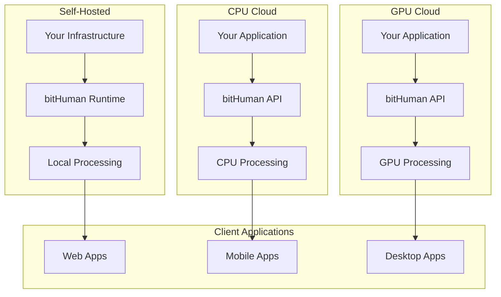

# Build with bitHuman Overview

> Choose the right deployment option for your use case, from self-hosted solutions to fully managed cloud services.

## Deployment Options

bitHuman offers flexible deployment options to match your technical requirements, security needs, and scale demands. Each option provides the same powerful avatar generation capabilities with different levels of control and management.

## 🏠 **Self-Hosted Model**

**Best For:** Organizations requiring maximum control, data privacy, or custom infrastructure integration.

### Key Benefits
- **Complete Control** - Full ownership of infrastructure and data
- **Data Privacy** - All processing happens on your premises
- **Customization** - Modify and extend functionality as needed
- **Cost Predictability** - Fixed infrastructure costs regardless of usage

### Use Cases
- Enterprise applications with strict security requirements
- High-volume applications where usage-based pricing is not optimal
- Organizations with existing GPU infrastructure
- Custom integrations requiring deep system access

### Requirements
- **Hardware**: NVIDIA GPU with 8GB+ VRAM (RTX 3080/4080 or better)
- **Software**: Docker, CUDA 11.8+, Python 3.9+
- **Network**: Stable internet for initial setup and updates
- **Expertise**: DevOps team for deployment and maintenance

---

## ☁️ **bitHuman CPU Cloud**

**Best For:** Applications with moderate usage, cost-sensitive deployments, or simpler integration requirements.

### Key Benefits
- **No Infrastructure** - Fully managed cloud service
- **Cost Effective** - Pay only for what you use
- **Easy Integration** - Simple API-based deployment
- **Automatic Scaling** - Handles traffic spikes automatically

### Use Cases
- Prototyping and development
- Small to medium-scale applications
- Cost-sensitive deployments
- Applications with variable usage patterns

### Features
- **Processing**: CPU-optimized inference
- **Latency**: 2-5 seconds per request
- **Concurrency**: Up to 10 concurrent requests
- **Integration**: REST API and WebSocket support

---

## 🚀 **bitHuman GPU Cloud**

**Best For:** Production applications requiring low latency, high throughput, or real-time interactions.

### Key Benefits
- **High Performance** - GPU-accelerated processing for minimal latency
- **Real-time Capable** - Sub-second response times
- **Enterprise Grade** - 99.9% uptime SLA
- **Global Scale** - Multiple regions for worldwide deployment

### Use Cases
- Real-time conversations and live streaming
- High-volume customer service applications
- Interactive gaming and entertainment
- Production applications with strict performance requirements

### Features
- **Processing**: GPU-accelerated inference
- **Latency**: <500ms per request
- **Concurrency**: Up to 100+ concurrent requests
- **Integration**: Advanced API features and WebRTC support

## Comparison Matrix

| Feature | Self-Hosted | CPU Cloud | GPU Cloud |
|---------|-------------|-----------|-----------|
| **Setup Complexity** | High | Low | Low |
| **Initial Cost** | High | Low | Medium |
| **Ongoing Cost** | Fixed | Usage-based | Usage-based |
| **Performance** | Customizable | Standard | High |
| **Latency** | Variable | 2-5s | <500ms |
| **Concurrency** | Hardware dependent | Up to 10 | Up to 100+ |
| **Data Privacy** | Maximum | Standard | Standard |
| **Maintenance** | Self-managed | Fully managed | Fully managed |
| **Customization** | Full | Limited | Standard |
| **SLA** | Self-managed | 99.5% | 99.9% |

## Architecture Overview

## Decision Framework

### Choose **Self-Hosted** if you need:
- ✅ Maximum data privacy and security
- ✅ Complete infrastructure control
- ✅ Custom modifications and integrations
- ✅ Predictable, fixed costs
- ✅ Existing GPU infrastructure

### Choose **CPU Cloud** if you have:
- ✅ Limited technical resources
- ✅ Variable or low usage patterns
- ✅ Cost-sensitive requirements
- ✅ Prototyping or development needs
- ✅ Simple integration requirements

### Choose **GPU Cloud** if you require:
- ✅ Real-time or low-latency responses
- ✅ High-volume production deployment
- ✅ Enterprise-grade reliability
- ✅ Global scale and availability
- ✅ Advanced features and integrations

## Migration Path

Start small and scale as needed:

1. **Prototype** with CPU Cloud for development and testing
2. **Scale** to GPU Cloud for production workloads
3. **Optimize** with Self-Hosted for enterprise requirements

Each deployment option is designed to work seamlessly with the same codebase, making migration straightforward as your needs evolve.

## Getting Started

Select your deployment path:

1. **[Self-Hosted Model](self-hosted.md)** - Complete setup guide for on-premises deployment
2. **[bitHuman CPU Cloud](cpu-cloud.md)** - Quick start with managed CPU processing  
3. **[bitHuman GPU Cloud](gpu-cloud.md)** - High-performance managed GPU processing

Each guide provides step-by-step instructions, code examples, and best practices for successful deployment.

---

*Choose the deployment option that best fits your current needs. You can always migrate to a different option as your requirements change.* 