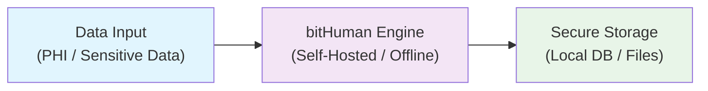

# bitHuman GDPR, HIPAA & SOC 2 Compliance Overview

bitHuman is designed to meet stringent **GDPR**, **HIPAA**, and **SOC 2** requirements for data security, privacy, and integrity.  
Our architecture allows you to deploy self-hosted and 100% offline, eliminating the risk of data leakage while maintaining full compliance with regulatory standards.

---

## Self-Hosted & Offline Capability
bitHuman can be deployed entirely within your secure infrastructure, with no internet connection required.  
All processing, including AI inference and storage, happens locally. This ensures sensitive information never leaves your environment.

---

## HIPAA Compliance
By keeping all Protected Health Information (PHI) within your own network, bitHuman supports HIPAA compliance.  
Our system design follows the confidentiality, integrity, and availability safeguards outlined by HIPAA.  
This includes secure access control, audit logs, and encryption options.

---

## SOC 2 Alignment
bitHuman's architecture and operational best practices align with SOC 2 Trust Service Criteria:  
**Security**, **Availability**, **Processing Integrity**, **Confidentiality**, and **Privacy**.  
Our model can operate in both on-premise and secure cloud environments while adhering to these principles.

---

## GDPR Compliance
bitHuman supports GDPR compliance through data localization and privacy-by-design principles.  
When deployed offline, personal data processing occurs entirely within your controlled environment, ensuring compliance with data sovereignty requirements.  
Users maintain complete control over data processing, storage, and deletion as required by GDPR.

---

## Why bitHuman SDK is Compliant

### Data Isolation
Unlike cloud-based AI services, bitHuman processes all data locally within your infrastructure. This means:
- **No data transmission** to external servers or cloud providers
- **Complete control** over where and how data is stored
- **Elimination of third-party risks** that could compromise compliance

### Privacy by Design
bitHuman is built with privacy as a core principle:
- **Local processing** ensures sensitive data never leaves your environment
- **No external dependencies** for core AI functionality
- **Configurable security settings** to meet your specific compliance requirements

### Regulatory Alignment
The offline-first architecture naturally aligns with compliance requirements:
- **GDPR**: Data remains within your jurisdiction and control
- **HIPAA**: PHI stays within your secure network environment
- **SOC 2**: All Trust Service Criteria can be maintained through your existing infrastructure controls

---

## No Third-Party Data Sharing
When deployed offline or on your infrastructure, bitHuman does not transmit data to any third-party services.  
This eliminates the common compliance risk of external data exposure.

---

## Compliance Features Summary

| Feature | Benefit |
|---------|---------|
| **Self-Hosted & Offline** | No internet access required, no data leaves your premises |
| **GDPR Compliant** | Data sovereignty and privacy-by-design architecture |
| **HIPAA Ready** | Full control of PHI, compliant safeguards in place |
| **SOC 2 Aligned** | Meets Trust Service Criteria for security & privacy |
| **No Data Leakage** | All processing contained within your environment |

---

## bitHuman Offline Workflow

Below is a simplified workflow showing how bitHuman operates in a fully offline, self-hosted mode to ensure compliance:

### Key Compliance Benefits:
1. **Data Input** — All sensitive data is collected within your secure environment
2. **bitHuman Engine** — Processing occurs entirely offline within your network
3. **Secure Storage** — Data never leaves your controlled storage environment
4. **No Internet Access Required** — Eliminates any chance of external data exposure
