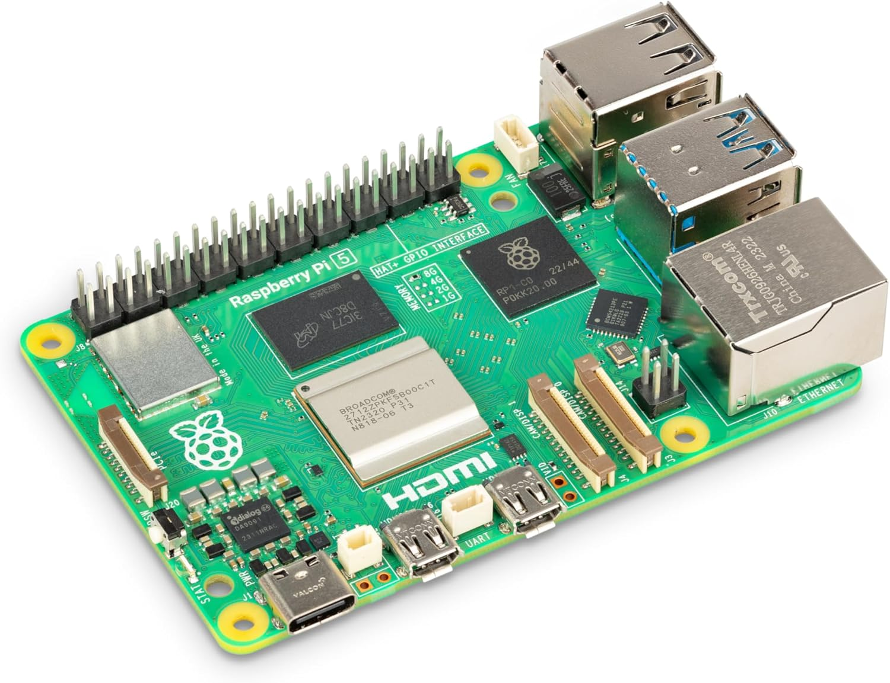
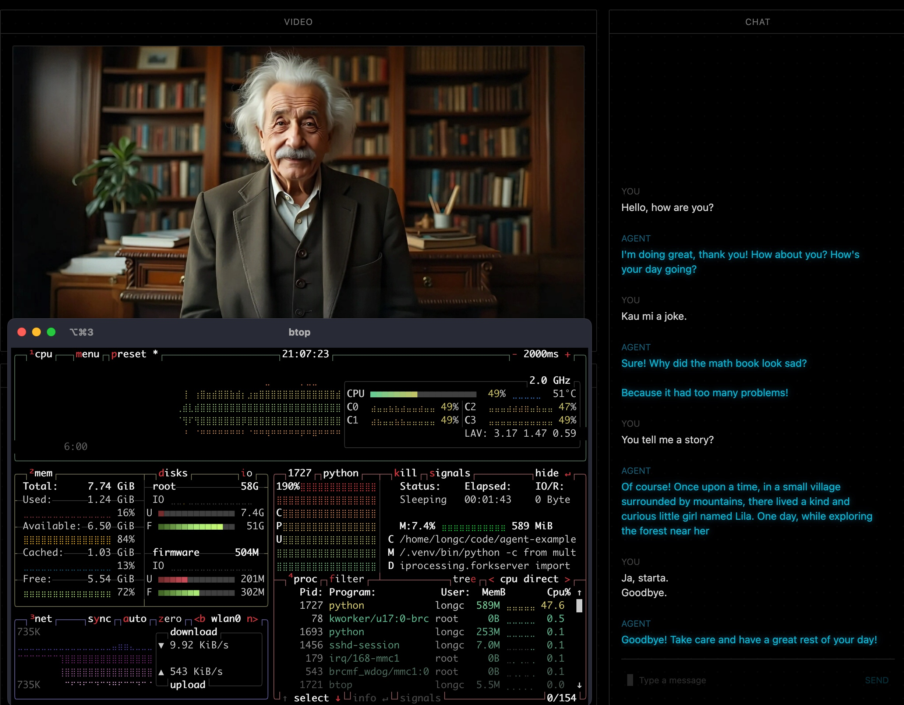

# 🥧 Raspberry Pi Agent

> **Run avatar on Raspberry Pi**

Perfect for IoT, kiosks, and edge devices.


*Raspberry Pi 4B setup for avatar deployment*

---

## 🚀 Quick Start

### 1. Hardware needed
- Raspberry Pi 4B (8GB RAM recommended)
- microSD card (32GB+, Class 10)
- USB microphone
- Stable internet connection
- **Separate computer** for web interface (recommended)

### 2. Install OS
Use **Raspberry Pi OS (64-bit)** with Raspberry Pi Imager

### 3. Setup Pi
```bash
# Update system
sudo apt update && sudo apt upgrade -y

# Install Python 3.11
sudo apt install python3.11 python3.11-venv -y

# Create environment
python3.11 -m venv bithuman-env
source bithuman-env/bin/activate
```

### 4. Install dependencies
```bash
pip install bithuman --upgrade livekit-agents openai
sudo apt install portaudio19-dev -y
```

### 5. Set environment
```bash
export BITHUMAN_API_SECRET="your_secret"
export BITHUMAN_MODEL_PATH="/home/pi/model.imx"
export LIVEKIT_API_KEY="your_livekit_key"
export LIVEKIT_API_SECRET="your_livekit_secret"
export LIVEKIT_URL="wss://your-project.livekit.cloud"
export OPENAI_API_KEY="your_openai_key"
export LOADING_MODE="SYNC"  # Important for Pi performance!
```

### 6. Setup web interface (**Recommended: Separate Device**)

⚠️ **Performance Note**: For best results, run the web interface on a separate computer. Running both the agent and web UI on the same Pi can cause significant slowdown and throttling.

**On a separate computer:**
```bash
git clone https://github.com/livekit/agents-playground.git
cd agents-playground
npm install && npm run dev
```

### 7. Run agent

📁 **[View source code on GitHub](https://github.com/bithuman-prod/public-docs/blob/main/examples/agent-livekit-rasp-pi.py)**

**Choose your mode:**

**For web streaming (recommended):**
```bash
python examples/agent-livekit-rasp-pi.py dev
```

**For command line testing:**
```bash
python examples/agent-livekit-rasp-pi.py console
```

---

## 💡 What it does

1. Runs avatar agent optimized for Raspberry Pi
2. Uses `SYNC` loading mode for memory efficiency
3. Connects to web browsers via LiveKit
4. Perfect for always-on edge applications


*Web interface showing Pi-powered avatar in action*

**Pi-specific optimizations:**
- Synchronous model loading (`LOADING_MODE="SYNC"`)
- Lower memory limits (1500MB warning threshold)
- Single process mode for stability
- Extended initialization timeout (120s)

---

## 🔧 Common Issues

**Out of memory?**
- Use Pi 4B with 8GB RAM (recommended)
- Enable swap: `sudo dphys-swapfile swapon`
- Close unnecessary processes
- Run in headless mode for better performance

**Slow performance?**
- Use ethernet instead of WiFi
- Check CPU temperature: `vcgencmd measure_temp`
- Use faster microSD card (Class 10 or better)

**Audio problems?**
- Check USB microphone: `arecord -l`
- Test microphone: `arecord -d 5 test.wav`
- Verify ALSA configuration

**Model loading timeout?**
- Ensure `LOADING_MODE="SYNC"` is set
- Increase timeout in code if needed
- Use faster storage (USB SSD)

---

## 🎯 Perfect for

✅ **Headless server deployments**  
✅ **Smart home assistants**  
✅ **IoT projects**  
✅ **Edge computing**  
✅ **Always-on applications**  
✅ **Remote installations**

**💡 Pro Tip**: Run Pi in headless mode with web interface on terminal devices for optimal performance.

---

## 🔧 Auto-start Service

Make it run automatically on boot:

**1. Create service file:**
```bash
sudo nano /etc/systemd/system/bithuman-agent.service
```

**2. Add configuration:**
```ini
[Unit]
Description=bitHuman Avatar Agent
After=network.target

[Service]
Type=simple
User=pi
WorkingDirectory=/home/pi
Environment=LOADING_MODE=SYNC
Environment=BITHUMAN_API_SECRET=your_secret
Environment=BITHUMAN_MODEL_PATH=/home/pi/model.imx
ExecStart=/home/pi/bithuman-env/bin/python examples/agent-livekit-rasp-pi.py dev
Restart=always
RestartSec=10

[Install]
WantedBy=multi-user.target
```

**3. Enable service:**
```bash
sudo systemctl enable bithuman-agent
sudo systemctl start bithuman-agent

# Check status
sudo systemctl status bithuman-agent
```

---

## ⚡ Performance Tips

**System optimization:**
```bash
# Enable performance governor
echo 'performance' | sudo tee /sys/devices/system/cpu/cpu*/cpufreq/scaling_governor

# Disable unnecessary services
sudo systemctl disable bluetooth
sudo systemctl disable wifi  # if using ethernet
```

**Memory optimization:**
- Use swap file for extra memory
- Store models on USB SSD if possible
- Monitor with `htop` or `free -h`

---

## 🔌 Hardware Add-ons

**Sensors integration:**
- Temperature/humidity sensors
- Motion detection
- Light sensors
- Camera module

**Example sensor integration:**
```python
import board
import adafruit_dht

# Add environmental awareness
dht = adafruit_dht.DHT22(board.D4)
temperature = dht.temperature
humidity = dht.humidity
```

---

## ➡️ Next Steps

**Add sensors?** → Integrate environmental awareness  
**Add camera?** → Use Pi camera for visual context  
**Scale up?** → Deploy multiple Pi devices  
**Go local?** → Replace OpenAI with local LLM

**Need help?** → Join our [Discord community](https://discord.gg/ES953n7bPA) for Pi-specific discussions!

---

*Edge AI made accessible!* 🤖 