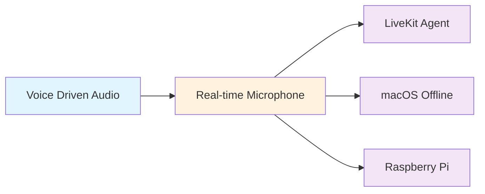

# Examples Overview

> Practical, ready-to-use examples demonstrating bitHuman SDK capabilities across different platforms and use cases.

## Example Categories

Our examples are organized by complexity and use case, from basic audio processing to advanced real-time streaming applications. Each example includes complete source code, setup instructions, and explanations of key concepts.

## 🎵 **Audio Processing Examples**

Learn the fundamentals of bitHuman avatar generation through audio-focused examples.

### [Voice Driven Avatar from Audio Clip](voice-driven-audio.md)
**Difficulty:** Beginner | **Time:** 15 minutes

Process pre-recorded audio files to generate synchronized avatar videos. Perfect for:
- Content creation and video production
- Batch processing of audio content
- Learning basic bitHuman concepts
- Creating recorded presentations

**Key Features:**
- Audio file loading and processing
- Video generation and export
- Performance optimization
- Error handling and validation

### [Real Time Avatar Driven by Microphone](realtime-microphone.md)
**Difficulty:** Intermediate | **Time:** 30 minutes

Capture live microphone input and generate real-time avatar responses. Ideal for:
- Interactive applications
- Live presentations
- Voice-controlled interfaces
- Real-time demonstrations

**Key Features:**
- Real-time audio capture
- Voice activity detection
- Live video display
- Audio quality enhancement

## 🌐 **Real-Time Streaming Examples**

Advanced examples showing how to deploy bitHuman agents in production environments.

### [Real Time Visual Agent via LiveKit](livekit-agent.md)
**Difficulty:** Advanced | **Time:** 60 minutes

Deploy production-ready agents using LiveKit's WebRTC infrastructure. Perfect for:
- Video conferencing applications
- Live streaming platforms
- Multi-participant environments
- Enterprise-grade deployments

**Key Features:**
- WebRTC streaming
- Multi-participant support
- Production monitoring
- Docker deployment

### [Real Time Visual Agent on macOS (Offline)](macos-offline.md)
**Difficulty:** Intermediate | **Time:** 45 minutes

Run bitHuman agents completely offline on macOS with local processing. Great for:
- Privacy-sensitive applications
- Offline demonstrations
- Local development
- Apple Silicon optimization

**Key Features:**
- Offline processing
- macOS optimization
- Local GUI interface
- Performance monitoring

### [Real Time Visual Agent on Raspberry Pi](raspberry-pi.md)
**Difficulty:** Advanced | **Time:** 90 minutes

Deploy agents on edge devices for IoT and embedded applications. Excellent for:
- Edge computing scenarios
- Kiosk applications
- IoT integrations
- Resource-constrained environments

**Key Features:**
- ARM64 optimization
- Resource management
- IoT integration
- Systemd service deployment

## Example Progression

We recommend following this learning path:



### 📚 **Learning Path**

1. **Start with Basics** - [Voice Driven Audio](voice-driven-audio.md)
   - Understand core bitHuman concepts
   - Learn audio processing fundamentals
   - Master basic SDK usage

2. **Add Real-time Processing** - [Real-time Microphone](realtime-microphone.md)
   - Handle live audio streams
   - Implement real-time responses
   - Manage performance considerations

3. **Choose Your Platform** - Select based on your needs:
   - **[LiveKit](livekit-agent.md)** for web applications
   - **[macOS](macos-offline.md)** for local desktop apps
   - **[Raspberry Pi](raspberry-pi.md)** for edge deployment

## Technical Requirements

### Minimum System Requirements

| Example | CPU | RAM | GPU | Platform |
|---------|-----|-----|-----|----------|
| Voice Driven Audio | 2 cores | 4GB | Optional | Any |
| Real-time Microphone | 4 cores | 8GB | Recommended | Any |
| LiveKit Agent | 4 cores | 8GB | Required | Linux/macOS |
| macOS Offline | Apple M1+ | 16GB | Integrated | macOS 15+ |
| Raspberry Pi | ARM64 | 4GB | None | Raspberry Pi 4B+ |

### Software Dependencies

Each example includes specific setup instructions, but common requirements include:

```bash
# Core dependencies
pip install bithuman numpy opencv-python

# Audio processing
pip install pyaudio sounddevice

# Real-time streaming
pip install asyncio websockets

# Platform-specific packages (varies by example)
pip install livekit-rtc  # LiveKit
pip install psutil       # System monitoring
```

## Code Structure

All examples follow a consistent structure for easy learning:

```
example-name/
├── README.md              # Setup and usage instructions
├── main.py               # Primary application code
├── config.py             # Configuration management
├── requirements.txt      # Python dependencies
├── utils/               # Utility functions
│   ├── audio.py         # Audio processing helpers
│   ├── video.py         # Video processing helpers
│   └── performance.py   # Performance monitoring
└── examples/            # Additional example variants
    ├── basic.py         # Simplified version
    ├── advanced.py      # Feature-rich version
    └── production.py    # Production-ready version
```

## Key Learning Concepts

### 🎯 **Core Concepts**
- **AsyncBithuman Runtime** - Main SDK interface
- **AudioChunk Processing** - Audio data handling
- **VideoFrame Generation** - Avatar animation
- **Error Handling** - Robust application design

### 🔧 **Advanced Topics**
- **Performance Optimization** - Efficient resource usage
- **Real-time Processing** - Low-latency applications
- **Multi-threading** - Concurrent processing
- **Production Deployment** - Scalable architectures

### 🚀 **Platform Integration**
- **WebRTC Streaming** - Browser-based deployment
- **Local Processing** - Offline applications
- **Edge Computing** - IoT and embedded systems
- **Cloud Deployment** - Scalable cloud services

## Best Practices

### 📋 **Development Guidelines**
- Start with simple examples and gradually increase complexity
- Test thoroughly on your target platform
- Monitor performance metrics during development
- Implement proper error handling from the beginning

### 🔒 **Security Considerations**
- Validate all audio input for security
- Implement rate limiting for production use
- Use secure connections for streaming
- Protect API keys and credentials

### 📊 **Performance Tips**
- Profile your application to identify bottlenecks
- Use appropriate hardware for your use case
- Implement efficient audio buffering
- Monitor memory usage and optimize accordingly

## Getting Started

### Quick Start (5 minutes)
1. Choose the [Voice Driven Audio](voice-driven-audio.md) example
2. Download an audio file for testing
3. Follow the setup instructions
4. Run your first bitHuman avatar!

### Production Deployment (60+ minutes)
1. Complete the basic examples first
2. Choose your target platform
3. Follow the advanced example for your platform
4. Implement monitoring and error handling
5. Deploy with proper security measures

## Example Templates

Each example serves as a template you can customize:

- **Modify prompts** to change agent personality
- **Adjust video settings** for different quality/performance tradeoffs
- **Add custom integrations** for your specific use case
- **Implement additional features** like recording or analytics

## Community Examples

Beyond our official examples, explore community-contributed implementations:

- **Gaming NPCs** - Interactive game characters
- **Educational Tutors** - Subject-specific teaching assistants
- **Customer Service** - Automated support agents
- **Entertainment** - Virtual influencers and personalities

---

*Ready to start building? Pick an example that matches your experience level and use case. Each example is designed to teach you something new while providing practical, working code you can build upon.* 