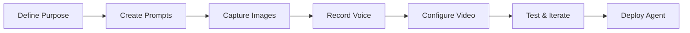

# Generate bitHuman Agent Overview

> Learn how to create compelling and effective bitHuman agents with our comprehensive guidelines.

## What is a bitHuman Agent?

A bitHuman agent is a digital avatar powered by AI that can interact with users through realistic facial expressions, voice, and movements. Creating an effective agent requires careful attention to four key components: prompts, images, voice, and video behavior.

## Core Components

### 🎯 **Prompt Guidelines**
The foundation of your agent's personality and behavior. Well-crafted prompts ensure your agent responds appropriately and maintains consistent character throughout interactions.

**Key Focus Areas:**
- Personality definition and tone
- Response style and formatting
- Context awareness and memory
- Behavioral boundaries and limitations

### 🎨 **Image Guidelines**
Visual appearance sets the first impression. High-quality images ensure your agent looks professional and engaging while maintaining visual consistency across different lighting and expressions.

**Key Focus Areas:**
- Portrait composition and framing
- Lighting and background requirements
- Facial expression variety
- Technical specifications for optimal results

### 🎤 **Voice Guidelines**
Voice brings your agent to life. The right voice selection and audio quality ensure natural, engaging conversations that match your agent's personality and use case.

**Key Focus Areas:**
- Voice selection and personality matching
- Audio quality and recording standards
- Speech patterns and cadence
- Multilingual considerations

### 🎬 **Video Guidelines**
Movement and animation create the illusion of life. Proper video guidelines ensure smooth, natural movements that enhance rather than distract from the conversation.

**Key Focus Areas:**
- Animation timing and synchronization
- Gesture appropriateness and frequency
- Facial expression mapping
- Performance optimization

## Creation Workflow

### Step-by-Step Process

1. **Define Your Agent's Purpose**
   - Identify the target audience
   - Determine primary use cases
   - Establish personality traits

2. **Develop Compelling Prompts**
   - Write clear, specific instructions
   - Define conversation boundaries
   - Test with various scenarios

3. **Capture High-Quality Images**
   - Follow technical specifications
   - Ensure consistent lighting
   - Capture multiple expressions

4. **Record Professional Voice**
   - Select appropriate voice talent
   - Maintain audio quality standards
   - Consider emotional range

5. **Configure Video Behavior**
   - Set animation parameters
   - Optimize for target platforms
   - Test across different devices

## Best Practices

### ✅ **Do's**
- Start with a clear agent purpose and personality
- Maintain consistency across all components
- Test thoroughly before deployment
- Gather user feedback and iterate
- Follow technical specifications precisely

### ❌ **Don'ts**
- Rush the creation process
- Ignore audio/video quality standards
- Create conflicting personality traits
- Skip testing with real users
- Overlook platform-specific requirements

## Quality Checklist

Before finalizing your agent, ensure:

- [ ] **Prompts** are clear, consistent, and appropriate
- [ ] **Images** meet technical requirements and quality standards
- [ ] **Voice** matches personality and maintains consistent quality
- [ ] **Video** animations are smooth and natural
- [ ] **Integration** works seamlessly across platforms
- [ ] **Testing** has been completed with target audience

## Common Use Cases

### 🏢 **Business Applications**
- Customer service representatives
- Sales assistants and product demos
- Training and onboarding guides
- Brand ambassadors

### 🎓 **Educational Content**
- Virtual tutors and instructors
- Interactive learning companions
- Language practice partners
- Subject matter experts

### 🎮 **Entertainment & Media**
- Virtual influencers and personalities
- Interactive storytellers
- Game characters and NPCs
- Social media content creators

### 🏥 **Healthcare & Wellness**
- Patient education assistants
- Therapy and counseling support
- Fitness and wellness coaches
- Mental health companions

## Getting Started

Ready to create your first bitHuman agent? Follow this sequence:

1. **[Prompt Guidelines](prompt-guidelines.md)** - Start here to define your agent's personality
2. **[Image Guidelines](image-guidelines.md)** - Create compelling visual appearance
3. **[Voice Guidelines](voice-guidelines.md)** - Add natural, engaging voice
4. **[Video Guidelines](video-guidelines.md)** - Configure realistic movements and expressions

Each guide provides detailed instructions, examples, and best practices to help you create professional-quality agents that engage and delight your users.

---

*Building effective bitHuman agents requires attention to detail and adherence to best practices. Take time to follow each guideline carefully for optimal results.* 