# 🐾 Animal Mode

> **Create amazing animal avatars with automatic face detection**

Transform your favorite animals into interactive avatars with our specialized animal mode.

---

## 🎯 Animal Avatar Creation

Animal Mode uses advanced AI to automatically detect and map animal facial features, enabling you to create engaging animal characters for your applications.

---

## 🐨 Available Animal Characters

Checkout some example animal agents. You can either use prompts to generate or upload your favorite pet photos:

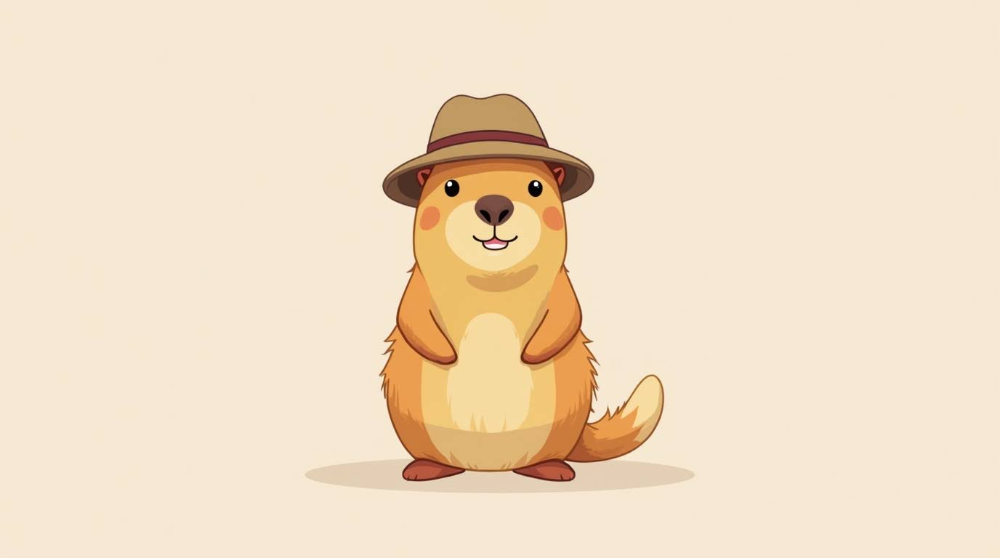

<strong>Capybara</strong>

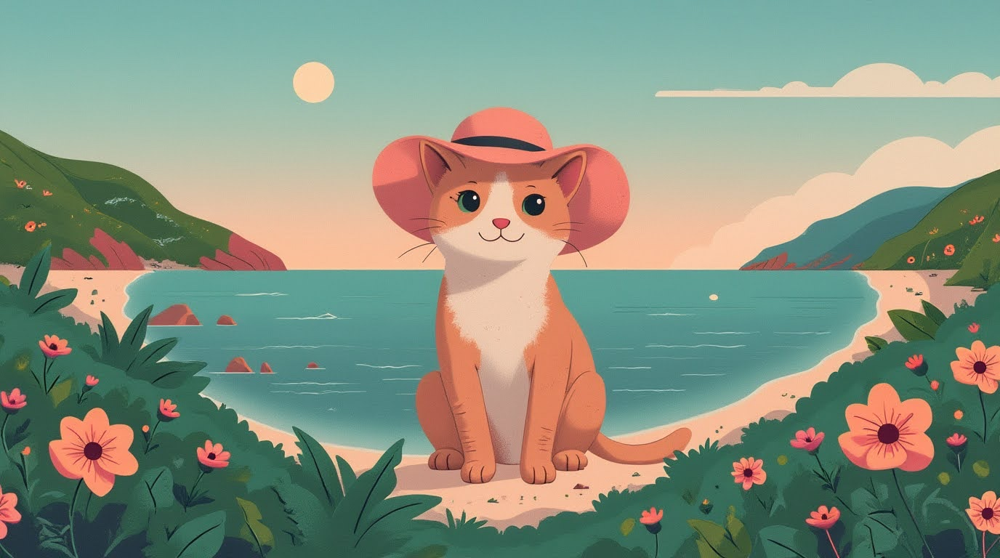

<strong>Cat in Hat</strong>

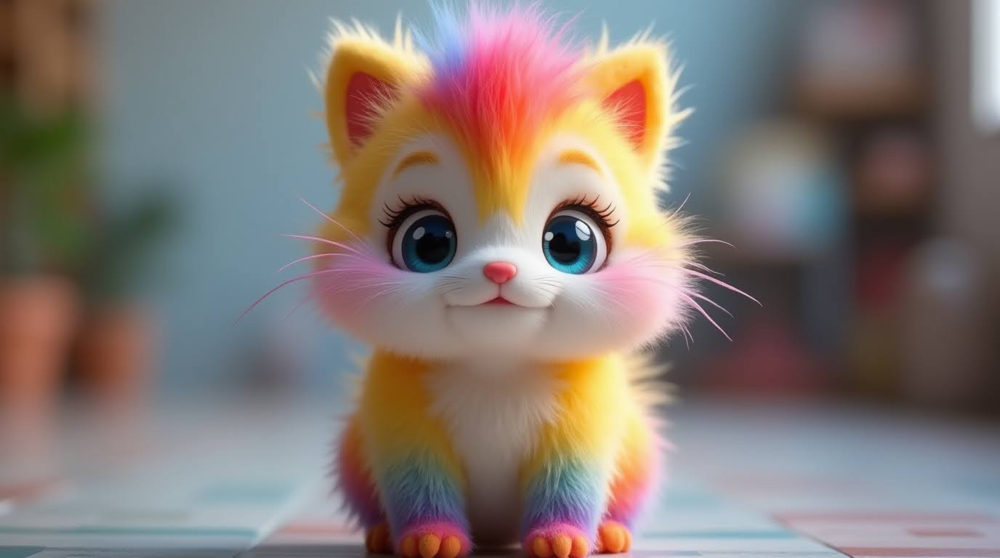

<strong>Rainbow Creature</strong>

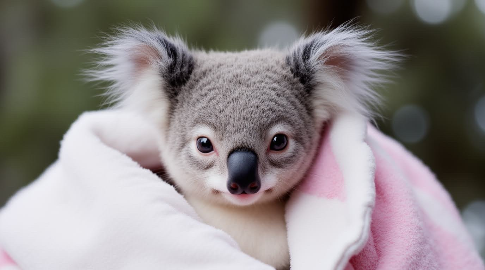

<strong>Koala</strong>

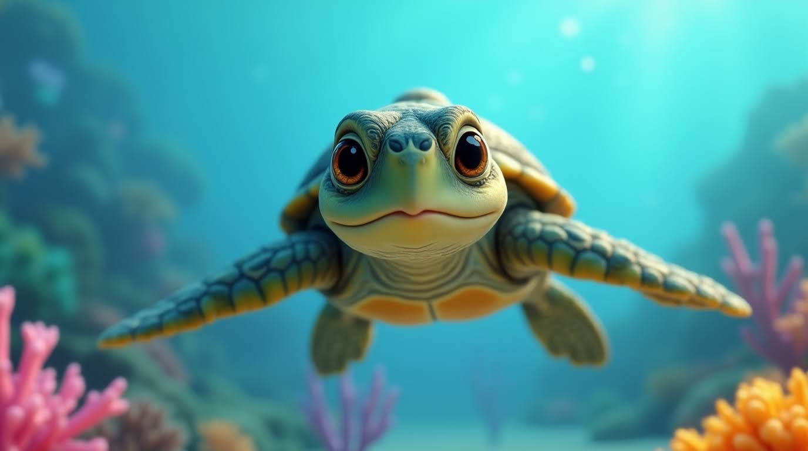

<strong>Pixar Turtle</strong>

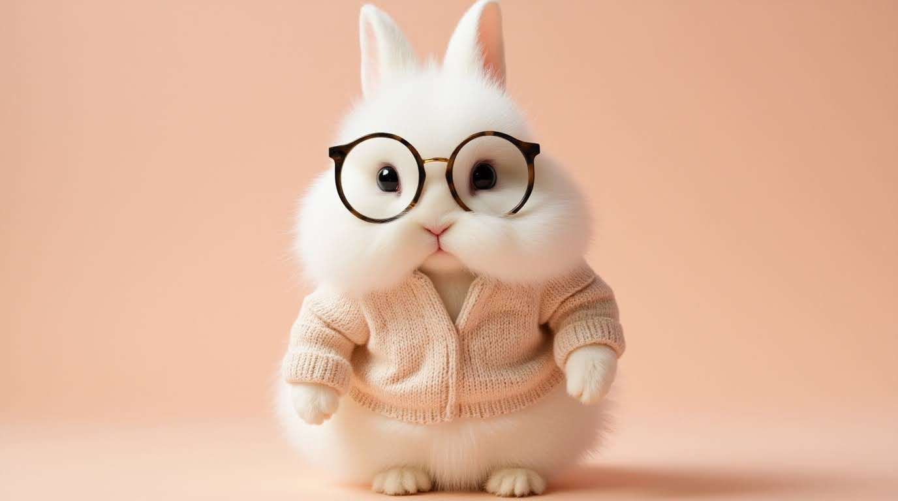

<strong>Bunny with Glasses</strong>

<strong>White Bunny</strong>

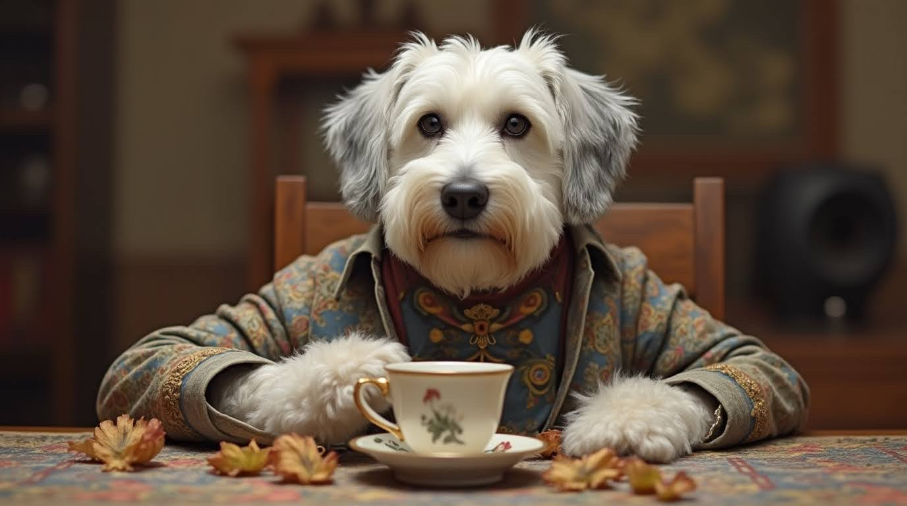

<strong>English Sheepdog</strong>

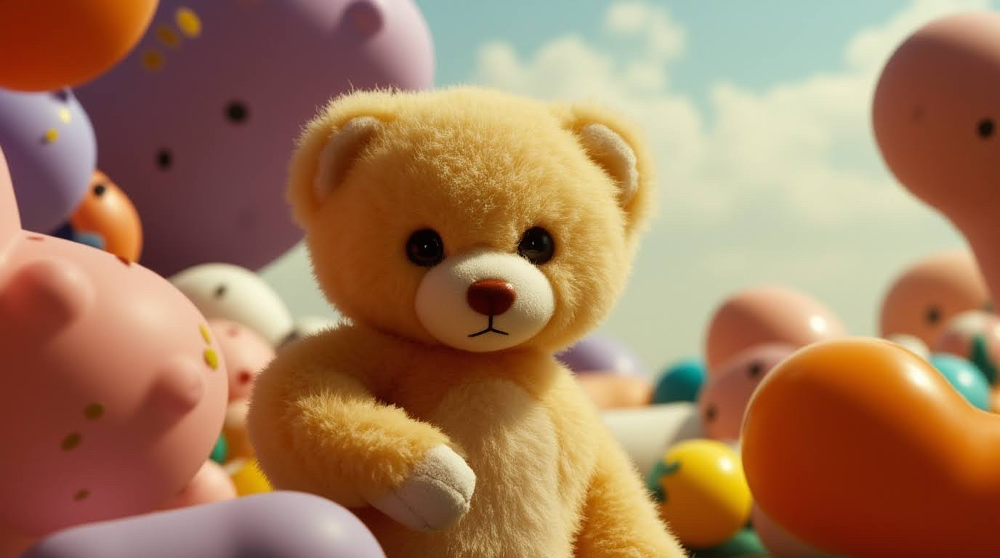

<strong>Teddy Bear</strong>

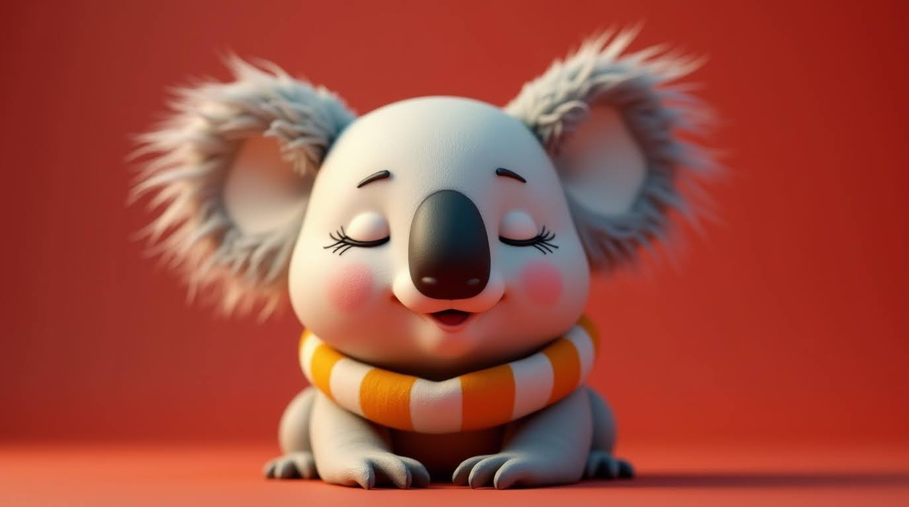

<strong>Character D12</strong>

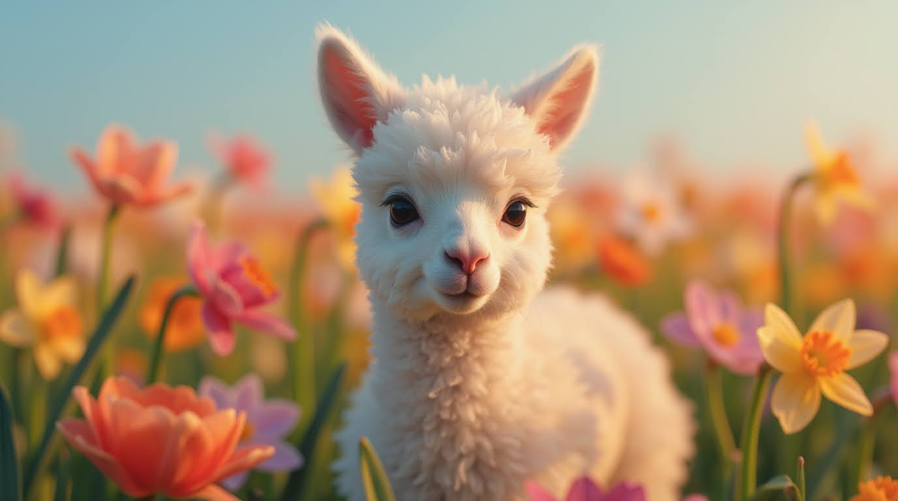

<strong>Character D7</strong>

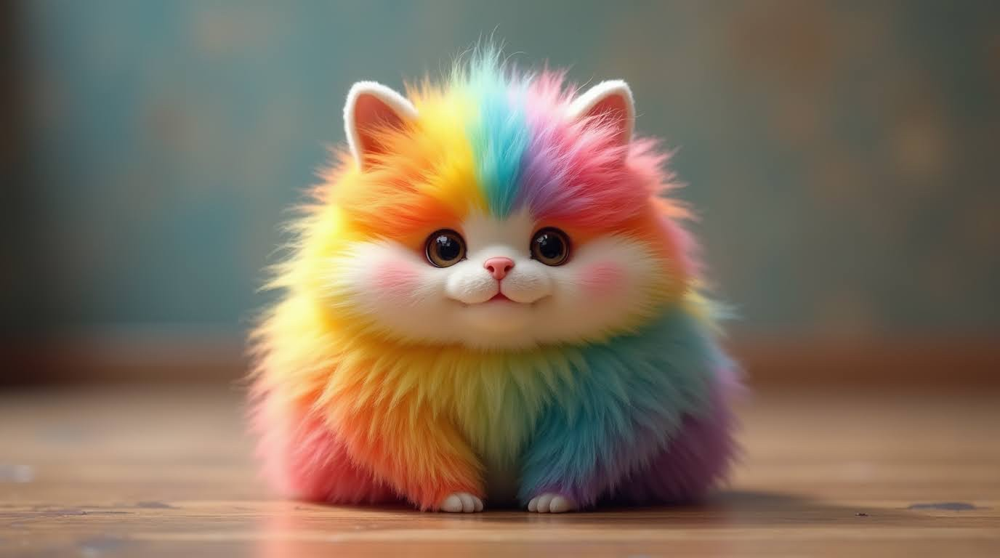

<strong>Fluffy Creature</strong>

*Choose any animal above to get started with your animal avatar creation!*

---

## 🤖 Automatic Face Detection

Our AI system automatically attempts to locate the character's face and body in animal images. This enables natural movement and expression mapping.

### ✅ **What Works Automatically:**
- 👁️ **Eye tracking** for natural gaze
- 👄 **Mouth detection** for speech sync
- 🎭 **Expression mapping** for emotions
- 📐 **Facial landmarks** for precise animation

---

## 🛠️ Manual Face Marking

Sometimes automatic detection needs a helping hand! When our AI can't locate facial features automatically, you'll be prompted to manually mark key points.

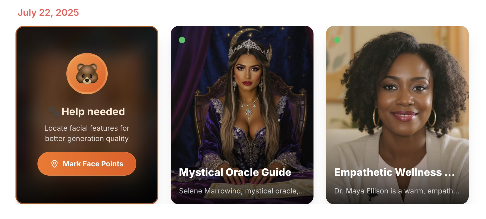
*When automatic detection needs assistance*

### 📍 **Manual Marking Process:**

When prompted, you'll mark these key facial points:

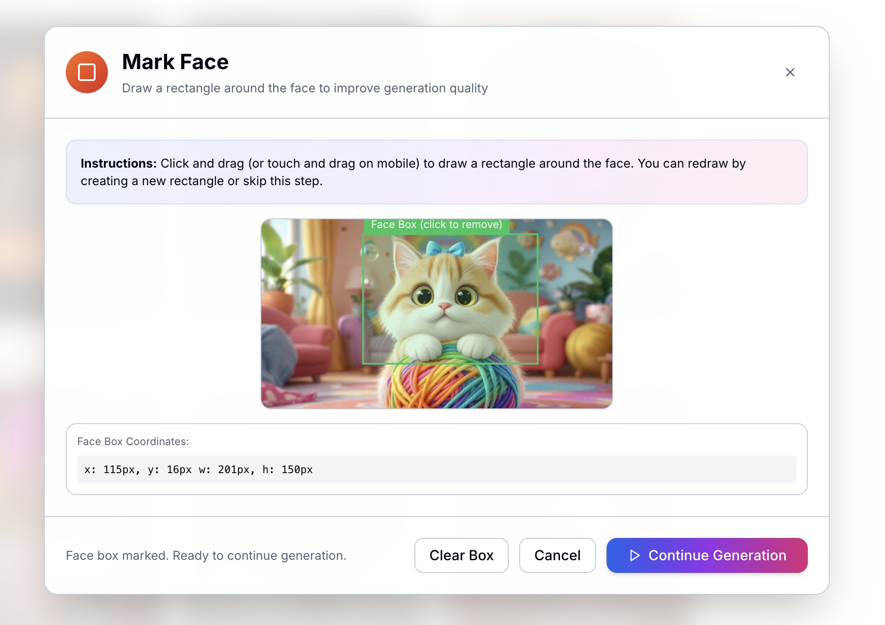
*Draw a rectangle to encompass the entire facial area*

**Required Area:**
The marked rectangle should cover the required facial region including:
- 👁️ **Eyes** - both left and right eyes
- 👃 **Nose** - nose area
- 👄 **Mouth** - complete mouth region
- 🔹 **Chin** - lower face boundary

Simply draw a rectangle that encompasses the entire face area. There is no need to individually select specific points.

---

## 💡 Best Practices for Animal Avatars

**🎯 For Optimal Results:**
- ✅ **Clear facial features** - ensure eyes, nose, mouth are visible
- ✅ **Front-facing pose** - straight-on view works best
- ✅ **Good contrast** - features should stand out from background
- ✅ **High resolution** - more detail = better detection

**⚠️ Common Challenges:**
- Fur covering facial features
- Side profile poses
- Complex lighting or shadows
- Cartoonish or stylized features

**🔧 Pro Tips:**
- Start with our pre-selected animals for guaranteed compatibility
- Use well-lit, high-contrast images
- Be patient with manual marking - precision improves results
- Test with simple expressions first

---

## 🚀 Getting Started

**Ready to create your animal avatar?**

1. **🎯 Choose** an animal character from the grid above
2. **⚡ Let AI** attempt automatic face detection
3. **✋ Help mark** facial points if needed
4. **🎬 Generate** your interactive animal avatar!

---

*Create your animal avatar at [imaginex.bithuman.ai](https://imaginex.bithuman.ai)!*

**Love animals?** Join our [Discord community](https://discord.gg/ES953n7bPA) to share your creations and get tips! 🐾