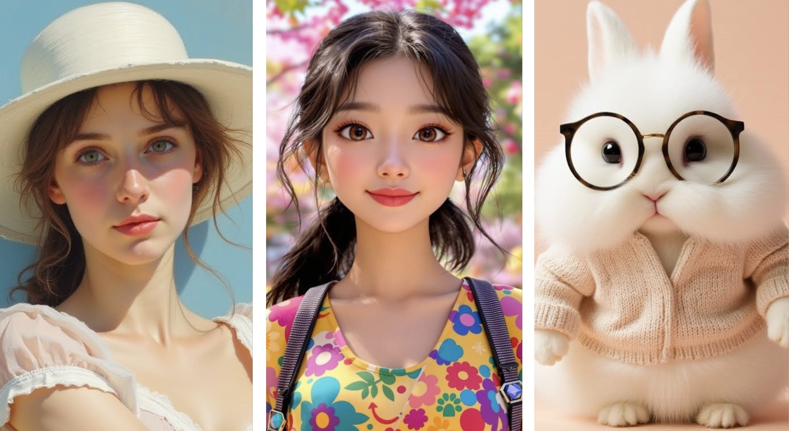

# 🎬 Media Guide

> **Upload your voice, image, and video to create personalized avatars**

Learn how to prepare and upload media for the best avatar generation results.

---

## 🎯 Media Upload Overview

The ImagineX platform allows you to upload multiple types of media to create your perfect avatar. Each type serves a specific purpose in building your character's appearance, voice, and personality.

*Follow our guidelines for optimal media uploads*

---

## 🎤 Voice Upload

**Perfect for**: Voice cloning and personalized speech patterns

### Requirements:
- ✅ **Duration**: Less than 1 minute
- ✅ **Quality**: Clear voice without background noise
- ✅ **Format**: MP3, WAV, or M4A
- ✅ **Content**: Natural speech in your target language

### Best Practices:
- 🎙️ **Record in a quiet environment**
- 📱 **Use a good quality microphone** 
- 🗣️ **Speak naturally and clearly**
- 🎵 **Avoid music or sound effects**
- 📝 **Include varied sentences** for better voice modeling

---

## 📸 Image Upload

**Perfect for**: Facial likeness and character appearance

### Requirements:
- ✅ **File Size**: Less than 10MB
- ✅ **Character Count**: One and only one person in the image
- ✅ **Position**: Character centered in frame
- ✅ **Orientation**: Camera facing (front-view)
- ✅ **Expression**: Calm and gentle expression
- ✅ **Quality**: High resolution and well-lit

### Best Practices:
- 📷 **Good lighting** - avoid shadows on face
- 🎯 **Clear focus** - sharp, not blurry
- 👤 **Solo shots** - no other people visible
- 🎭 **Neutral expression** - avoid extreme emotions
- 🖼️ **Professional quality** - passport-style photos work well

---

## 🎥 Video Upload

**Perfect for**: Movement patterns and dynamic expressions

### Requirements:
- ✅ **Duration**: Less than 30 seconds
- ✅ **Character Count**: One and only one person in frame
- ✅ **Position**: Character centered in frame
- ✅ **Movement**: Minimal distracting movement
- ✅ **Quality**: High resolution, stable footage

### Best Practices:
- 🎬 **Stable camera** - use tripod if possible
- 🎯 **Consistent framing** - keep character centered
- 🚶‍♀️ **Subtle movements** - gentle head movements, natural blinking
- 💡 **Good lighting** - consistent throughout video
- 🔇 **Audio optional** - focus on visual quality

---

## 🎯 Media Priority System

Understanding how different uploads influence and overwrite each other:

```mermaid
graph TD
    subgraph "📤 User Uploads"
        A[📝 Prompt<br/><i>Character Description</i>]
        B[📸 Image<br/><i>Face/Appearance</i>]
        C[🎥 Video<br/><i>Face + Movement</i>]
        D[🎤 Voice<br/><i>Speech Audio</i>]
    end
    
    subgraph "🎯 Likeness Generation"
        E{🎥 Video<br/>Uploaded?}
        E -->|Yes| F[🎥 Video OVERWRITES Image<br/>Uses video for likeness]
        E -->|No| G{📸 Image<br/>Uploaded?}
        G -->|Yes| H[📸 Image for Likeness<br/>📝 Auto-generates persona<br/><i>Prompt becomes optional</i>]
        G -->|No| I[📝 Prompt-Only<br/>Generates appearance<br/>from description]
    end
    
    subgraph "🗣️ Voice Generation"
        J{🎤 Voice<br/>Uploaded?}
        J -->|Yes| K[🎤 Uses Uploaded Voice<br/>Clones speech patterns]
        J -->|No| L[🤖 Auto-Generated Voice<br/>Matches persona/appearance]
    end
    
    subgraph "✨ Final Result"
        M[🎭 Complete Avatar<br/>👤 Likeness + 🗣️ Voice + 💭 Personality]
    end
    
    A --> E
    B --> E
    C --> E
    
    F --> J
    H --> J
    I --> J
    
    K --> M
    L --> M
    
    style F fill:#ff6b6b,stroke:#fff,color:#fff
    style H fill:#ffa726,stroke:#fff,color:#fff
    style I fill:#66bb6a,stroke:#fff,color:#fff
    style K fill:#42a5f5,stroke:#fff,color:#fff
    style M fill:#ab47bc,stroke:#fff,color:#fff
```

### **Key Priority Rules:**
1. **🎥 Video > 📸 Image** - Video always overwrites image for likeness
2. **📸 Image = Auto-Prompt** - Images auto-generate persona, making manual prompts optional
3. **🎤 Voice** - When uploaded, replaces auto-generated voice
4. **✨ Prompt** - Required only when no image/video provided

### **Upload Combinations:**

**📝 Prompt Only:**
- ✅ Generates likeness, voice, and movement from text description
- 🎯 Perfect for fictional characters or specific personas

**📸 Image Only:**
- ✅ Uses image for likeness
- ✅ Auto-generates persona and voice from appearance
- ✅ **No prompt needed** - system derives personality from image
- 🎯 Great for bringing photos to life instantly

**🎤 Voice + 📸 Image:**
- ✅ Image provides likeness
- ✅ Voice provides speech patterns
- ✅ System generates personality to match
- 🎯 Best for realistic character recreation

**🎥 Video + 🎤 Voice + 📝 Prompt:**
- ✅ Video provides likeness and movement style
- ✅ Voice provides speech patterns  
- ✅ Prompt guides personality
- 🎯 **Ultimate combination** for full character control

---

## 💡 Best Practices

**🎯 Recommended Approaches:**

**🚀 Simple & Effective:**
- **📝 Prompts Only** - Great for creative/fictional characters
- **📸 Image Only** - Instant avatar from photo (no prompt needed!)
- **📸 Image + 🎤 Voice** - Perfect realistic recreation

**🔄 Iterative Refinement:**
- Start with image for instant results, OR basic prompts for creative concepts
- Add voice for personalization 
- Upload image when you want specific likeness
- Fine-tune and change elements anytime

**⚠️ Common Issues:**
- Poor lighting in images/videos
- Background noise in audio
- Multiple people in frame
- Excessive movement in videos

**🔧 Quick Fixes:**
- Use photo editing to improve lighting
- Record audio in quiet spaces
- Crop images to show only target person
- Keep movements subtle and natural

**💡 Pro Tip:** Start simple! Upload just an image for instant results, or use prompts for creative characters. You can always add voice or refine later.

---

*Ready to upload your media? Visit [console.bithuman.io](https://console.bithuman.io) to get started!*

**Questions?** Join our [Discord community](https://discord.gg/yM7wRRqu) for media upload tips and tricks! ✨ 