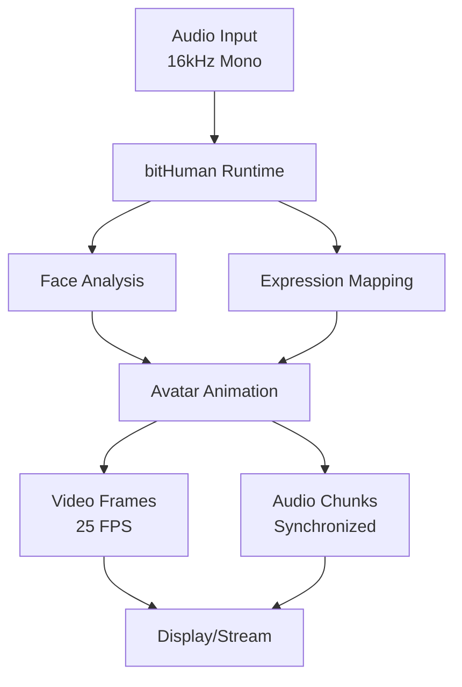

# Overview

Welcome to bitHuman SDK! This guide will help you understand what bitHuman SDK is, what you can build with it, and how to get started.

## What is bitHuman SDK?

bitHuman SDK is a powerful toolkit that enables developers to create **lifelike digital avatars** that respond realistically to audio input. Our SDK transforms static applications into engaging, interactive experiences with human-like digital beings.

## Key Capabilities

### 🎯 Real-time Avatar Animation
- Generate 25 FPS video with synchronized audio
- Realistic facial movements and expressions
- Lip-sync accuracy with audio input
- Emotional expression mapping

### 🎤 Audio Processing
- Support for 16kHz mono audio input
- Real-time audio analysis and processing
- Voice-driven facial animation
- Seamless audio-video synchronization

### 🚀 Flexible Deployment
- **Self-hosted**: Run on your own infrastructure
- **CPU Cloud**: Cost-effective cloud processing
- **GPU Cloud**: High-performance cloud acceleration
- Edge deployment support

### 🔌 Easy Integration
- Simple Python API
- Works with popular frameworks (LiveKit, FastRTC)
- WebRTC streaming capabilities
- Custom application integration

## How It Works

1. **Audio Input**: Provide 16kHz mono audio (live microphone, audio files, or streaming)
2. **Processing**: SDK analyzes audio for phonemes, emotions, and timing
3. **Animation**: Avatar model responds with realistic facial movements
4. **Output**: Synchronized video frames and audio chunks ready for display/streaming

## Use Cases

### 🎬 Interactive Content & Education
- Virtual teachers and trainers
- Interactive storytelling
- Educational demonstrations
- Language learning assistants

### 🛒 E-commerce & Retail
- Virtual shopping assistants
- Product demonstrations
- Personalized recommendations
- Customer onboarding

### 📞 Customer Service & Support
- AI-powered customer service agents
- Virtual receptionists
- Technical support avatars
- Multilingual assistance

### 🎮 Gaming & Entertainment
- Realistic NPCs in games
- Virtual influencers
- Interactive entertainment
- Metaverse experiences

### 🏢 Business & Communication
- Virtual presenters
- Meeting assistants
- Training simulations
- Corporate communications

## Platform Support

| Platform | Status | Requirements |
|----------|--------|--------------|
| **Linux x86_64** | ✅ Full Support | Ubuntu 20.04+ recommended |
| **Linux ARM64** | ✅ Full Support | Great for edge devices |
| **macOS Apple Silicon** | ✅ Full Support | macOS 15+ required |
| **Windows** | 🔄 Coming Soon | Beta available on request |

## Prerequisites

Before getting started, make sure you have:

- **Python 3.10 to 3.13** installed
- A **bitHuman account** (free registration)
- An **avatar model file** (.imx format)
- Basic familiarity with Python programming

## What You'll Learn

In this Getting Started section, you'll learn how to:

1. **[Install the SDK](installation.md)** - Set up bitHuman SDK in your environment
2. **[Validate your API secret](validate-api.md)** - Confirm your credentials work
3. **[Run your first model](first-model.md)** - Create your first animated avatar

## Architecture Overview

### Core Components

- **AsyncBithuman**: Main runtime class for avatar processing
- **AudioChunk**: Audio data representation and utilities
- **VideoFrame**: Avatar output with frame data and metadata
- **Model Files**: Avatar definitions (.imx format)

### Data Flow

1. Initialize runtime with API secret and model
2. Send audio data as AudioChunks
3. Receive VideoFrames with avatar animation
4. Display frames or stream to viewers

## Getting Help

- 📖 **Documentation**: Complete guides and API reference
- 🌟 **[Community Hub](https://console.bithuman.io/#community)**: Download models and examples
- 💬 **Discord**: Join our developer community
- 🐛 **GitHub Issues**: Report bugs and request features

Ready to get started? Let's [install the SDK](installation.md) and create your first avatar! 