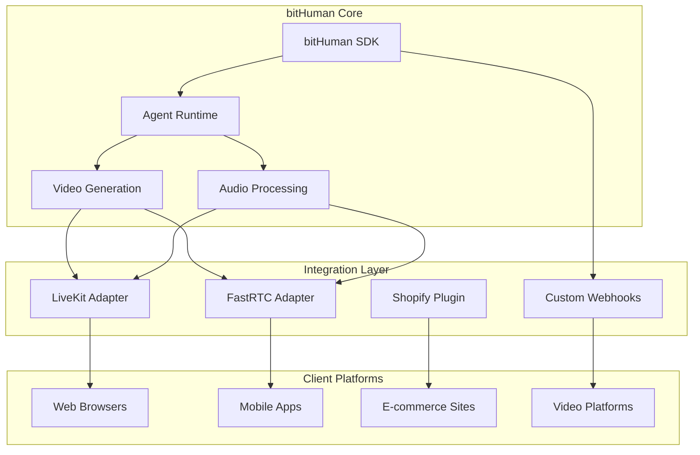

# Integrations Overview

> Connect bitHuman agents seamlessly with popular platforms and services for enhanced functionality and reach.

## Integration Ecosystem

bitHuman is designed to integrate smoothly with modern web technologies, real-time communication platforms, and e-commerce solutions. Our integrations enable you to deploy interactive agents across multiple channels and use cases.

## 🌐 **Supported Platforms**

### Real-Time Communication
- **[LiveKit](livekit.md)** - WebRTC video conferencing and live streaming
- **[FastRTC](fastrtc.md)** - Simplified WebRTC for direct peer-to-peer connections

### E-Commerce
- **[Shopify](shopify.md)** - Interactive shopping assistants and product recommendations

### Coming Soon
- **Discord** - Bot integrations for community engagement
- **Twitch** - Live streaming interactive avatars
- **Zoom** - Virtual meeting participants and assistants
- **Slack** - Workplace collaboration and support bots

## Integration Types

### 📹 **Real-Time Video Streaming**

Stream bitHuman agents directly to video calls, conferences, and live broadcasts.

**Key Features:**
- Low-latency video streaming
- Multi-participant support
- Audio synchronization
- Quality adaptation

**Use Cases:**
- Virtual meeting participants
- Live streaming personalities
- Interactive webinars
- Customer service video calls

### 🛒 **E-Commerce Platforms**

Embed intelligent shopping assistants that understand products and provide personalized recommendations.

**Key Features:**
- Product knowledge integration
- Personalized recommendations
- Shopping cart assistance
- Order support and tracking

**Use Cases:**
- Virtual shopping assistants
- Product demonstration guides
- Customer onboarding
- Post-purchase support

### 🤖 **Messaging & Chat**

Deploy conversational agents across messaging platforms and chat interfaces.

**Key Features:**
- Multi-platform deployment
- Context-aware responses
- Rich media support
- Analytics and insights

**Use Cases:**
- Customer support chatbots
- Sales qualification
- Lead generation
- Community management

## Integration Architecture



## Quick Start Guide

### 1. **Choose Your Platform**
Select the integration that best fits your use case:
- **LiveKit** for professional video conferencing
- **FastRTC** for simple peer-to-peer connections
- **Shopify** for e-commerce applications

### 2. **Install Dependencies**
Each integration has specific requirements:
```bash
# LiveKit
pip install livekit-rtc livekit-api

# FastRTC  
pip install fastrtc

# Shopify
pip install shopify-python-api
```

### 3. **Configure Authentication**
Set up API keys and credentials for your chosen platform.

### 4. **Deploy Your Agent**
Follow the platform-specific deployment guide.

## Integration Comparison

| Platform | Complexity | Use Case | Real-time | Scalability |
|----------|------------|----------|-----------|-------------|
| **LiveKit** | Medium | Video conferencing, streaming | ✅ Yes | High |
| **FastRTC** | Low | Simple video calls | ✅ Yes | Medium |
| **Shopify** | Low | E-commerce assistance | ❌ No | High |

## Development Workflow

### 1. **Local Development**
Start with local testing using the basic bitHuman SDK:
```python
from bithuman import AsyncBithuman

# Test your agent locally first
runtime = await AsyncBithuman.create(
    api_secret="your_secret",
    model_path="path/to/model.imx"
)
```

### 2. **Integration Setup**
Add platform-specific adapters and configuration:
```python
# Example: LiveKit integration
from integrations.livekit import LiveKitAdapter

adapter = LiveKitAdapter(
    bithuman_runtime=runtime,
    room_config=room_config
)
```

### 3. **Testing & Validation**
Test your integration thoroughly:
- Verify audio/video synchronization
- Test with multiple users
- Monitor performance metrics
- Validate error handling

### 4. **Production Deployment**
Deploy using platform-specific best practices:
- Configure monitoring and logging
- Set up auto-scaling
- Implement health checks
- Monitor usage metrics

## Best Practices

### 🎯 **Performance Optimization**
- Use appropriate hardware for your integration type
- Implement efficient buffering for real-time streams
- Monitor latency and optimize accordingly
- Cache frequently accessed data

### 🔒 **Security Considerations**
- Implement proper authentication for all endpoints
- Use HTTPS/WSS for all communications
- Validate all input data
- Monitor for unusual usage patterns

### 📊 **Monitoring & Analytics**
- Track key performance metrics
- Monitor user engagement
- Set up alerts for system issues
- Analyze usage patterns for optimization

### 🛠 **Error Handling**
- Implement graceful fallbacks
- Provide clear error messages
- Log errors for debugging
- Set up automated recovery mechanisms

## Common Integration Patterns

### **WebRTC Streaming Pattern**
```python
# Real-time video streaming to web browsers
async def stream_to_webrtc(audio_input):
    video_frame, audio_chunk = await runtime.process_audio(audio_input)
    await webrtc_adapter.send_frame(video_frame, audio_chunk)
```

### **E-commerce Assistant Pattern**
```python
# Shopping assistance with product knowledge
async def shopping_assistant(user_query, product_context):
    response = await runtime.process_with_context(user_query, product_context)
    await ecommerce_adapter.send_response(response)
```

### **Chat Integration Pattern**
```python
# Text-based conversations with avatar responses
async def chat_integration(message):
    avatar_response = await runtime.generate_response(message)
    await chat_adapter.send_message(avatar_response)
```

## Getting Started

Choose your integration path:

1. **[LiveKit Integration](livekit.md)** - Professional video conferencing and streaming
2. **[FastRTC Integration](fastrtc.md)** - Simple, direct WebRTC connections
3. **[Shopify Integration](shopify.md)** - E-commerce shopping assistants

Each integration guide provides:
- Step-by-step setup instructions
- Complete code examples
- Best practices and optimization tips
- Troubleshooting guides
- Production deployment strategies

---

*Start with the integration that matches your immediate needs. All integrations are designed to work together, so you can combine multiple platforms as your use case evolves.* 