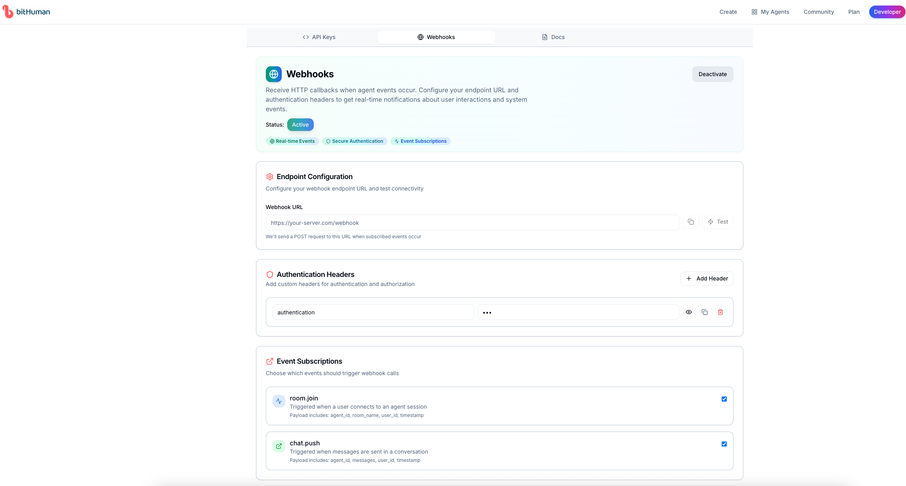

# 🔔 Webhook Integration

> **Get real-time notifications when users interact with your avatars**

Connect your applications to receive instant HTTP callbacks when avatar events occur - from user conversations to session analytics.

---

## ✨ What Are Webhooks?

Webhooks let your application **automatically respond** to avatar events:

🎤 **User joins session** → Notify your CRM  
💬 **Chat message sent** → Log to database  

**Perfect for:** Analytics, CRM integration, Slack notifications, database logging, real-time dashboards

---

## 🚀 Quick Setup

### 1️⃣ **Configure Your Endpoint**

Navigate to the webhook configuration in your bitHuman developer dashboard:

#### **Step 1: Access Developer Dashboard**
Visit [imaginex.bithuman.ai/#developer](https://imaginex.bithuman.ai/#developer) and navigate to the **Webhooks** section.


*Configure your webhook settings in the developer dashboard*

#### **Step 2: Configure Endpoint URL**
Set up your webhook endpoint URL in the configuration panel:

```http
POST https://your-app.com/webhook
Content-Type: application/json
```

### 2️⃣ **Choose Events to Receive**

Select which events trigger your webhook:
- ✅ **room_join** - User connects to avatar
- ✅ **chat_push** - Messages in conversation

### 3️⃣ **Add Authentication (Recommended)**

Secure your endpoint with custom headers:
```http
Authorization: Bearer your-api-token
X-API-Key: your-secret-key
```

---

## 📨 Webhook Payload Examples

### **Room Join Event**
```json
{
  "agent_id": "agent_abc123",
  "event_type": "room.join",
  "data": {
    "room_name": "customer-support",
    "participant_count": 1,
    "session_id": "session_xyz789"
  },
  "timestamp": 1705312200.0
}
```

### **Chat Message Event**
```json
{
  "agent_id": "agent_abc123",
  "event_type": "chat.push",
  "data": {
    "role": "user",
    "message": "Hello, I need help with my order",
    "session_id": "session_xyz789",
    "timestamp": 1705312285.0
  },
  "timestamp": 1705312285.0
}
```

---

## 🛠️ Implementation Examples

### **Flask Server (Python)**
```python
from flask import Flask, request, jsonify
import hmac
import hashlib

app = Flask(__name__)
WEBHOOK_SECRET = "your-webhook-secret"

@app.route('/webhook', methods=['POST'])
def handle_webhook():
    # Verify signature (recommended)
    signature = request.headers.get('X-bitHuman-Signature', '')
    if not verify_signature(request.data, signature):
        return jsonify({'error': 'Invalid signature'}), 401
    
    data = request.json
    event_type = data.get('event_type')
    
    # Handle different events
    if event_type == 'room.join':
        handle_user_joined(data)
    elif event_type == 'chat.push':
        handle_new_message(data)
    
    return jsonify({'status': 'success'})

def handle_user_joined(data):
    agent_id = data.get('agent_id')
    room_data = data.get('data', {})
    session_id = room_data.get('session_id')
    room_name = room_data.get('room_name')
    participant_count = room_data.get('participant_count')
    
    print(f"User joined agent {agent_id} in room {room_name} (session: {session_id})")
    # Add your logic: Update CRM, send notification, etc.

def handle_new_message(data):
    agent_id = data.get('agent_id')
    message_data = data.get('data', {})
    role = message_data.get('role')
    message = message_data.get('message')
    session_id = message_data.get('session_id')
    
    print(f"New {role} message in session {session_id}: {message}")
    # Add your logic: Log to database, analyze sentiment, etc.

def verify_signature(payload, signature):
    expected = hmac.new(
        WEBHOOK_SECRET.encode(),
        payload,
        hashlib.sha256
    ).hexdigest()
    return hmac.compare_digest(f"sha256={expected}", signature)

if __name__ == '__main__':
    app.run(port=3000)
```

### **Express.js Server (Node.js)**
```javascript
const express = require('express');
const crypto = require('crypto');

const app = express();
app.use(express.json());

const WEBHOOK_SECRET = 'your-webhook-secret';

app.post('/webhook', (req, res) => {
  // Verify signature
  const signature = req.headers['x-bithuman-signature'];
  if (!verifySignature(req.body, signature)) {
    return res.status(401).json({ error: 'Invalid signature' });
  }

  const { event_type, agent_id, data } = req.body;

  switch (event_type) {
    case 'room.join':
      console.log(`User joined agent ${agent_id} in room ${data.room_name} (session: ${data.session_id})`);
      // Your logic here
      break;
      
    case 'chat.push':
      console.log(`New ${data.role} message in session ${data.session_id}: ${data.message}`);
      // Your logic here
      break;
  }

  res.json({ status: 'success' });
});

function verifySignature(payload, signature) {
  const expected = crypto
    .createHmac('sha256', WEBHOOK_SECRET)
    .update(JSON.stringify(payload))
    .digest('hex');
  return crypto.timingSafeEqual(
    Buffer.from(`sha256=${expected}`),
    Buffer.from(signature)
  );
}

app.listen(3000, () => {
  console.log('Webhook server running on port 3000');
});
```

---

## 🎯 Common Use Cases

### **📊 Analytics Dashboard**
```python
# Track user engagement metrics
def handle_chat_push(data):
    db.analytics.create({
        'agent_id': data['agentId'],
        'user_id': data['user']['id'],
        'message_type': data['message']['type'],
        'timestamp': data['timestamp'],
        'content_length': len(data['message']['content'])
    })
```

### **💬 Slack Notifications**
```python
import requests

def handle_room_join(data):
    slack_webhook = "https://hooks.slack.com/services/YOUR/SLACK/WEBHOOK"
    
    message = {
        "text": f"🤖 New user joined avatar!",
        "attachments": [{
            "color": "good",
            "fields": [
                {"title": "Agent", "value": data['agentId'], "short": True},
                {"title": "User", "value": data['user']['id'], "short": True}
            ]
        }]
    }
    
    requests.post(slack_webhook, json=message)
```

### **🗃️ Database Logging**
```python
# PostgreSQL with SQLAlchemy
def handle_room_join(data):
    agent_id = data.get('agent_id')
    room_data = data.get('data', {})
    session_id = room_data.get('session_id')
    room_name = room_data.get('room_name')
    participant_count = room_data.get('participant_count')
    timestamp = data.get('timestamp')
    
    user_session = UserSession.create({
        'agent_id': agent_id,
        'session_id': session_id,
        'room_name': room_name,
        'participant_count': participant_count,
        'started_at': timestamp
    })
    db.session.add(user_session)
    db.session.commit()
```

---

## 🔒 Security Best Practices

### **Signature Verification**
Always verify webhook signatures to ensure requests come from bitHuman:

```python
import hmac
import hashlib

def verify_webhook_signature(payload, signature, secret):
    expected = hmac.new(
        secret.encode('utf-8'),
        payload.encode('utf-8'),
        hashlib.sha256
    ).hexdigest()
    
    return hmac.compare_digest(
        f"sha256={expected}",
        signature
    )
```

### **IP Whitelisting**
Restrict webhook access to bitHuman servers:
```python
ALLOWED_IPS = ['52.14.127.', '18.216.155.']  # Example IPs

def is_allowed_ip(request_ip):
    return any(request_ip.startswith(ip) for ip in ALLOWED_IPS)
```

### **HTTPS Only**
- ✅ Always use HTTPS endpoints
- ✅ Valid SSL certificates required
- ❌ HTTP endpoints will be rejected

---

## 🧪 Testing Your Webhook

### **Local Development with ngrok**
```bash
# Expose local server for testing
ngrok http 3000

# Use the HTTPS URL in webhook settings
# Example: https://abc123.ngrok.io/webhook
```

### **Test Webhook Button**
Use the **Test** button in the bitHuman dashboard to send sample events to your endpoint.

### **Manual Testing**
```bash
# Test room.join event
curl -X POST https://your-app.com/webhook \
  -H "Content-Type: application/json" \
  -H "X-bitHuman-Signature: sha256=..." \
  -d '{
    "agent_id": "test_agent",
    "event_type": "room.join",
    "data": {
      "room_name": "test-room",
      "participant_count": 1,
      "session_id": "session_123"
    },
    "timestamp": 1705312200.0
  }'

# Test chat.push event
curl -X POST https://your-app.com/webhook \
  -H "Content-Type: application/json" \
  -H "X-bitHuman-Signature: sha256=..." \
  -d '{
    "agent_id": "test_agent",
    "event_type": "chat.push",
    "data": {
      "role": "user",
      "message": "Hello!",
      "session_id": "session_123",
      "timestamp": 1705312260.0
    },
    "timestamp": 1705312260.0
  }'
```

---

## 📈 Monitoring & Debugging

### **Response Requirements**
Your webhook endpoint must:
- ✅ Return HTTP 2xx status codes
- ✅ Respond within 30 seconds
- ✅ Handle duplicate events gracefully

### **Automatic Retries**
bitHuman automatically retries failed webhooks:
- **1st retry**: After 1 second
- **2nd retry**: After 5 seconds  
- **3rd retry**: After 30 seconds
- **Max attempts**: 3 total

### **Debug Common Issues**
| Issue | Cause | Solution |
|-------|-------|----------|
| **Signature Invalid** | Wrong secret or algorithm | Check HMAC SHA256 implementation |
| **Timeout Errors** | Slow processing | Return 200 immediately, process async |
| **404 Not Found** | Incorrect URL | Verify endpoint URL in dashboard |
| **SSL Errors** | Invalid certificate | Use valid HTTPS certificate |

---

## 🎉 Ready to Integrate?

1. **🔧 Set up your endpoint** - Create webhook handler in your app
2. **🔑 Configure in dashboard** - Add URL and auth headers at [imaginex.bithuman.ai/#developer](https://imaginex.bithuman.ai/#developer)
3. **🧪 Test integration** - Use the test button to verify
4. **📊 Monitor events** - Watch real-time notifications flow in

### **Need Help?**
- 📚 **Advanced patterns**: [Real-time Events Guide](integrations/event-handling.md)
- 💬 **Community support**: [Discord](https://discord.gg/yM7wRRqu)
- 🛠️ **Technical issues**: Check our troubleshooting guide

---

*Start receiving real-time avatar events in minutes! 🚀*
