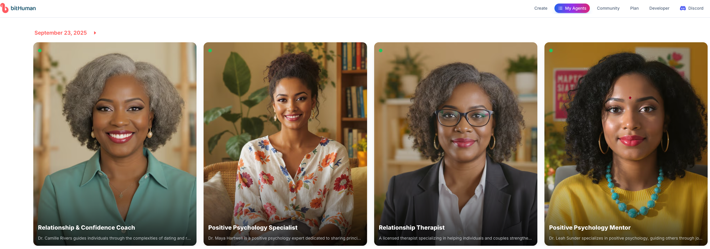
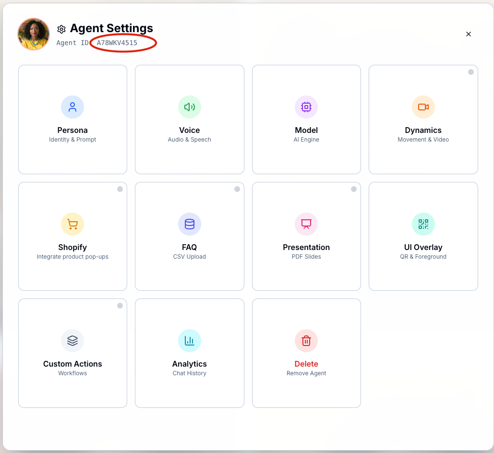

# 🚀 LiveKit Cloud Plugin

 

> **bitHuman LiveKit Cloud Plugin Integration**

Use existing bitHuman agents in real-time applications with our cloud-hosted LiveKit plugin featuring Essence (CPU) and Expression (GPU) models.

---

## 🚀 Quick Start

### 1. Install Cloud Plugin
```bash
# Uninstall existing plugin
uv pip uninstall livekit-plugins-bithuman

# Install cloud plugin from GitHub
GIT_LFS_SKIP_SMUDGE=1 uv pip install git+https://github.com/livekit/agents@main#subdirectory=livekit-plugins/livekit-plugins-bithuman
```

### 2. Get API Credentials
- **API Secret**: [imaginex.bithuman.ai](https://imaginex.bithuman.ai/#developer)

### 3. Find Your Agent ID

To use an existing avatar with the Expression Model, you'll need to locate your agent ID from the bitHuman platform.

#### Step 1: Select Your Agent
Navigate to your [imaginex.bithuman.ai](https://imaginex.bithuman.ai) dashboard and click on the agent card you want to use.


*Click on the agent card you want to use for integration*

#### Step 2: Access Agent Settings
Once you click on the agent, the **Agent Settings** dialog will open, displaying your unique **Agent ID** at the top.


*Copy the Agent ID from the Agent Settings dialog*

> **💡 Tip**: The Agent ID (e.g., `A78WKV4515`) is a unique identifier for your specific avatar. You'll use this as the `avatar_id` parameter in your code.

### 4. Set Environment
```bash
export BITHUMAN_API_SECRET="your_api_secret"
```

---

## 💡 Usage Examples

### **Essence Model (CPU) **
For standard avatar interactions with built-in personalities:

```python
import bithuman

# Create avatar session with essence model
bithuman_avatar = bithuman.AvatarSession(
    avatar_id="your_agent_code",
    api_secret="your_api_secret",
)

# Start conversation
response = bithuman_avatar.generate_response("Hello, how are you?")
```

### **Essence Model with Dynamics (RPC-based Gesture Triggers)**
For reactive avatar gestures triggered by user speech keywords:

**Step 1: Get Available Gesture Actions**

Before setting up keyword triggers, you should first retrieve the list of available gesture actions for your agent. The available gestures are user-defined and generated based on your agent's dynamics configuration. See the [Get Dynamics endpoint](./dynamics-api.md#get-dynamics) in the Dynamics API documentation for details.

```python
import requests

# Get available gestures for your agent
agent_id = "A04MXD0151"
url = f"https://public.api.bithuman.ai/v1/dynamics/{agent_id}"
headers = {"api-secret": "YOUR_API_SECRET"}

response = requests.get(url, headers=headers)
dynamics_data = response.json()

if dynamics_data.get("success"):
    available_gestures = dynamics_data["data"].get("gestures", [])
    print(f"Available gestures: {available_gestures}")
    # Example output: ["mini_wave_hello", "talk_head_nod_subtle", "blow_kiss_heart", "laugh_react"]
    # Note: Actual gestures depend on your agent's dynamics configuration
else:
    print("Failed to get dynamics or agent has no dynamics configured")
    available_gestures = []
```

> **Note:** The gesture actions are user-defined and vary based on your agent's dynamics generation. Always check the `gestures` array from the API response to see what actions are available for your specific agent.

**Step 2: Set Up Keyword-to-Action Mapping**

Once you know the available gestures, create a keyword mapping:

```python
from livekit.agents import AgentSession, JobContext, UserInputTranscribedEvent
from livekit import rtc
import asyncio
import json
from datetime import datetime

# Keyword-to-action mapping (use gestures from Step 1)
# Note: Map keywords to actual gesture names from available_gestures array
# The gesture names below are examples - use the actual names from your agent's dynamics
KEYWORD_ACTION_MAP = {
    "laugh": "laugh_react",
    "laughing": "laugh_react",
    "haha": "laugh_react",
    "funny": "laugh_react",
    # Add more mappings based on available_gestures from Step 1
    # Example mappings (adjust based on your agent's actual gestures):
    # "yes": "talk_head_nod_subtle",
    # "hello": "mini_wave_hello",
    # "kiss": "blow_kiss_heart",
}

async def send_dynamics_trigger(
    local_participant: rtc.LocalParticipant,
    destination_identity: str,
    action: str,
) -> None:
    """Send RPC message to trigger dynamics action"""
    payload = {
        "action": action,
        "identity": local_participant.identity,
        "timestamp": datetime.utcnow().isoformat(),
    }
    
    await local_participant.perform_rpc(
        destination_identity=destination_identity,
        method="trigger_dynamics",
        payload=json.dumps(payload),
    )

async def entrypoint(ctx: JobContext):
    """Agent entrypoint with dynamics support"""
    await ctx.connect()
    await ctx.wait_for_participant()
    
    # ... setup avatar session ...
    
    @session.on("user_input_transcribed")
    def on_user_input_transcribed(event: UserInputTranscribedEvent):
        """Detect keywords and trigger dynamics"""
        if not event.is_final:
            return
        
        transcript = event.transcript.lower()
        
        # Check for keywords
        for keyword, action in KEYWORD_ACTION_MAP.items():
            if keyword in transcript:
                # Trigger dynamics for all participants
                for identity in ctx.room.remote_participants.keys():
                    asyncio.create_task(
                        send_dynamics_trigger(
                            ctx.room.local_participant,
                            identity,
                            action
                        )
                    )
                break
```

**How it works:**
1. **Get available gestures** - Call `GET /v1/dynamics/{agent_id}` to retrieve the list of available gesture actions
2. **Map keywords to actions** - Create a keyword-to-action mapping using the gestures from step 1
3. **Listen for user input** - Agent listens to user speech via `user_input_transcribed` events
4. **Detect keywords** - When keywords like "laugh" are detected, it sends RPC messages to avatar workers
5. **Trigger gestures** - Avatar workers receive `trigger_dynamics` RPC calls and execute corresponding gestures
6. **Debounce protection** - Gestures are triggered with debounce protection to prevent spam

**Example Flow:**
1. Get dynamics status: `GET /v1/dynamics/A04MXD0151` → Returns `["mini_wave_hello", "talk_head_nod_subtle", "blow_kiss_heart", "laugh_react"]` (example - actual gestures depend on your agent)
2. User says "That's funny!" → Agent detects "funny" keyword
3. Agent sends RPC with `action: "laugh_react"` → Avatar performs laughing gesture

**Important:** Always verify that the gesture action exists in the `gestures` array before using it in your keyword mapping. Using a non-existent gesture will result in the RPC call being ignored by the avatar worker.

> **⏱️ Performance Note:** When using dynamics with RPC-based gesture triggers, the avatar worker model connection and loading typically takes approximately **20 seconds** on first initialization.

See [agent_with_dynamics.py](https://github.com/bithuman-prod/public-docs/tree/main/examples/cloud/essence/agent_with_dynamics.py) for a complete working example.

### **Expression Model (GPU) - Agent ID**
For custom avatars created through the platform (see [Find Your Agent ID](#3-find-your-agent-id) above for instructions):

```python
import bithuman

# Create avatar session with expression model
bithuman_avatar = bithuman.AvatarSession(
    avatar_id="your_agent_code",
    api_secret="your_api_secret",
    model="expression"
)

# Generate avatar response
response = bithuman_avatar.generate_response("Tell me about yourself")
```

### **Expression Model (GPU) - Custom Image**
For dynamic avatar creation using custom images:

```python
import bithuman
import os
from PIL import Image

# Create avatar session with custom image
bithuman_avatar = bithuman.AvatarSession(
    avatar_image=Image.open(os.path.join("your_image_path")),
    api_secret="your_api_secret",
    model="expression"
)

# Process custom image and generate response
response = bithuman_avatar.generate_response("Describe what you see")
```

---

## 🔧 Configuration Options

### **Avatar Session Parameters**

| Parameter | Type | Required | Description |
|-----------|------|----------|-------------|
| `avatar_id` | string | Yes* | Unique identifier for pre-created avatar |
| `avatar_image` | PIL.Image | Yes* | Custom image for dynamic avatar creation |
| `api_secret` | string | Yes | Authentication secret from bitHuman platform |
| `model` | string | No | Model type: "essence" (default) or "expression" |

*Either `avatar_id` or `avatar_image` is required, not both.

### **Model Types**

**Essence Model:**
- Pre-trained personalities and behaviors
- Optimized for conversational AI
- Faster response times
- Supports full body and animal mode

**Expression Model:**
- Dynamic facial expression mapping
- Image-based avatar generation
- Supports only face and shoulder & above
- Do not support animal mode at the moment

---

## 🌐 Cloud Advantages

✅ **No Local Storage** - No need to download large model files  
✅ **Auto-Updates** - Always use the latest model versions  
✅ **Scalability** - Handle multiple concurrent sessions  
✅ **Performance** - Optimized cloud infrastructure  
✅ **Cross-Platform** - Works on any device with internet  

---

## 🛠️ Advanced Integration

### **Session Management**
```python
import bithuman

class AvatarManager:
    def __init__(self, api_secret):
        self.api_secret = api_secret
        self.sessions = {}
    
    def create_session(self, session_id, avatar_id, model="essence"):
        self.sessions[session_id] = bithuman.AvatarSession(
            avatar_id=avatar_id,
            api_secret=self.api_secret,
            model=model
        )
        return self.sessions[session_id]
    
    def get_response(self, session_id, message):
        if session_id in self.sessions:
            return self.sessions[session_id].generate_response(message)
        return None

# Usage
manager = AvatarManager("your_api_secret")
session = manager.create_session("user_123", "avatar_456")
response = manager.get_response("user_123", "Hello!")
```

### **Error Handling**
```python
import bithuman

try:
    avatar = bithuman.AvatarSession(
        avatar_id="your_agent_code",
        api_secret="your_api_secret"
    )
    
    response = avatar.generate_response("Test message")
    
except bithuman.AuthenticationError:
    print("Invalid API secret. Check your credentials.")
    
except bithuman.QuotaExceededError:
    print("API quota exceeded. Upgrade your plan.")
    
except bithuman.NetworkError:
    print("Network connectivity issues. Check internet connection.")
    
except Exception as e:
    print(f"Unexpected error: {e}")
```

---

## 🔍 Monitoring & Debugging

### **Enable Logging**
```python
import logging
import bithuman

# Enable debug logging
logging.basicConfig(level=logging.DEBUG)
logger = logging.getLogger('bithuman')

avatar = bithuman.AvatarSession(
    avatar_id="your_agent_code",
    api_secret="your_api_secret",
    debug=True
)
```

### **Performance Metrics**
```python
import time
import bithuman

avatar = bithuman.AvatarSession(
    avatar_id="your_agent_code",
    api_secret="your_api_secret"
)

start_time = time.time()
response = avatar.generate_response("Performance test")
response_time = time.time() - start_time

print(f"Response generated in {response_time:.2f} seconds")
```

---

## 🚨 Common Issues

**Authentication Errors:**
- Verify API secret from [imaginex.bithuman.ai](https://imaginex.bithuman.ai/#api)
- Check environment variable is properly set

**Network Timeouts:**
- Ensure stable internet connection
- Consider implementing retry logic for production use

**Model Loading Issues:**
- Verify avatar_id exists in your account
- For expression model, ensure image format is supported (PNG, JPG, WEBP)

**Plugin Installation:**
- Use `uv` package manager as shown in installation
- Ensure `GIT_LFS_SKIP_SMUDGE=1` flag is included

---

## 🎯 Perfect for

✅ **Production Applications** - Reliable cloud infrastructure  
✅ **Scalable Solutions** - Handle thousands of concurrent users  
✅ **Mobile Applications** - No local storage requirements  
✅ **Enterprise Integration** - Professional-grade API  
✅ **Rapid Prototyping** - Quick setup without model management  

---

## 📊 Pricing & Limits

Visit [imaginex.bithuman.ai](https://imaginex.bithuman.ai/#api) for current pricing and usage limits.

**Free Tier Includes:**
- 199 credits per month
- Community support

**Pro Features:**
- Unlimited credits
- Priority support
- Custom model training

---

## ➡️ Next Steps

**API Documentation:** [Agent Generation API](agent-generation-api.md)  
**Local Examples:** [Examples Overview](../examples/overview.md)  
**Community Support:** [Discord](https://discord.gg/ES953n7bPA)  

---

*Cloud-powered avatars made simple!* ☁️✨